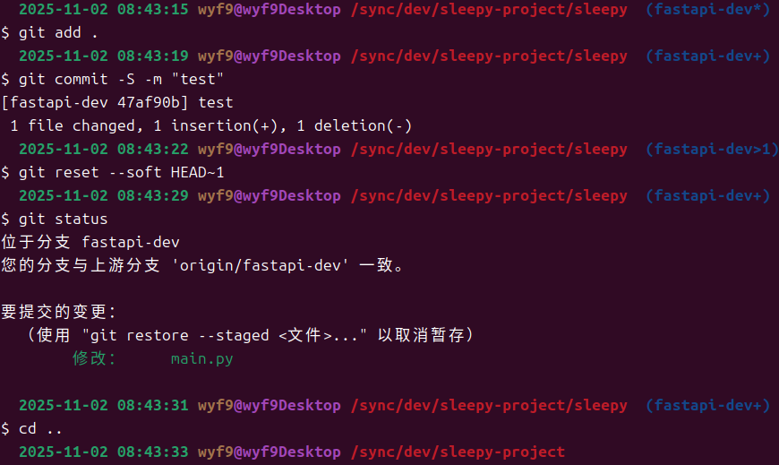
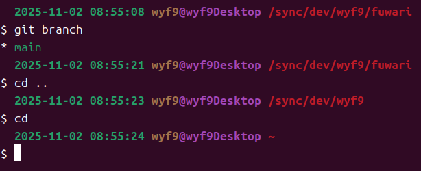
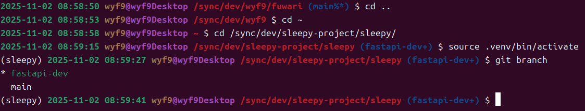
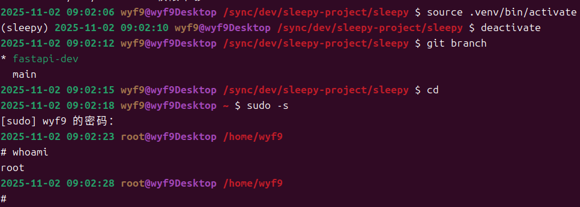

# Linux

> [!TIP]
> Install -> 一键执行写入 + 应用 <br/>
> Source -> 更详细，适合自行修改细节

## 完整版 (换行 ✅, Git ✅)

效果:



### Install

```bash
cat <<'EOF' >> ~/.bashrc && source ~/.bashrc

# region prompt
# https://wyf9.top/p/bashrc-ps1/#完整版-换行-git-
parse_git_status() {
  git rev-parse --git-dir >/dev/null 2>&1 || return
  local status=""
  local git_status=$(git status --porcelain 2>/dev/null)

  [[ $git_status =~ ^\?\? ]] && status+="%"
  [[ $git_status =~ ^.[MD] ]] && status+="*"
  [[ $git_status =~ ^[MADR] ]] && status+="+"

  local ab=$(git status --porcelain --branch 2>/dev/null | grep -o '\[.*\]')
  [[ $ab =~ ahead\ ([0-9]+) ]] && status+=">${BASH_REMATCH[1]}"
  [[ $ab =~ behind\ ([0-9]+) ]] && status+="<${BASH_REMATCH[1]}"

  local branch=$(git branch --show-current 2>/dev/null)
  [[ -z $branch ]] && branch=$(git rev-parse --short HEAD 2>/dev/null | sed 's/^/detached@/')
  [[ -n $branch ]] && echo " ($branch$status)"
}

PS1='${debian_chroot:+($debian_chroot) }\[\e[1;32m\]$(date +"%Y-%m-%d %H:%M:%S") \[\e[1;33m\]\u\[\e[35m\]@\h\[\e[1;31m\] \w \[\e[1;34m\]$(parse_git_status)\[\e[0m\]\n\$ '
# endregion prompt
EOF
```

### Source

```bash
# ~/.bashrc
# region prompt
# https://wyf9.top/p/bashrc-ps1/#%E5%AE%8C%E6%95%B4%E7%89%88-%E6%8D%A2%E8%A1%8C--git-

# Function to get Git status indicators
parse_git_status() {
  # Only run if in a Git repository
  if git rev-parse --git-dir >/dev/null 2>&1; then
    local status=""
    # Get porcelain output for concise status
    local git_status
    git_status=$(git status --porcelain 2>/dev/null)
    
    # Check for untracked files (?? in porcelain)
    if echo "$git_status" | grep -q "^??"; then
      status="${status}%"
    fi
    
    # Check for modified files ( M or D in second column)
    if echo "$git_status" | grep -q "^.[MD]"; then
      status="${status}*"
    fi
    
    # Check for staged files (M, A, D, R, C in first column)
    if echo "$git_status" | grep -q "^[MADR]"; then
      status="${status}+"
    fi
    
    # Check ahead/behind (optional, requires git status)
    local ahead_behind
    ahead_behind=$(git status --porcelain --branch 2>/dev/null | grep -o '\[.*\]')
    if [[ $ahead_behind =~ ahead\ ([0-9]+) ]]; then
      status="${status}>${BASH_REMATCH[1]}"
    fi
    if [[ $ahead_behind =~ behind\ ([0-9]+) ]]; then
      status="${status}<${BASH_REMATCH[1]}"
    fi
    
    # Get current branch or detached HEAD state
    local branch
    if git symbolic-ref HEAD >/dev/null 2>&1; then
      # Normal branch
      branch=$(git branch --show-current 2>/dev/null)
    else
      # Detached HEAD: try to describe the state
      branch=$(git describe --all --contains HEAD 2>/dev/null | sed 's/heads\///')
      if [ -z "$branch" ]; then
        branch="detached@$(git rev-parse --short HEAD 2>/dev/null)"
      else
        branch="detached@$branch"
      fi
    fi
    
    # Output branch with status indicators
    if [ -n "$branch" ]; then
      echo " ($branch$status)"
    fi
  fi
}

# PS1 prompt with Git status indicators

PS1=' ${debian_chroot:+($debian_chroot) }\[\e[1;32m\]$(date +"%Y-%m-%d %H:%M:%S") \[\e[1;33m\]\u\[\e[35m\]@\h\[\e[1;31m\] \w \[\e[1;34m\]$(parse_git_status)\[\e[0m\]\n\$ '

# endregion prompt
```

## 无 Git 版 (换行 ✅, Git ❌)

效果:



### Install

```bash
cat <<'EOF' >> ~/.bashrc && source ~/.bashrc
# https://wyf9.top/p/bashrc-ps1/#无-git-版-换行-git-
PS1='${debian_chroot:+($debian_chroot) }\[\e[1;32m\]$(date +"%Y-%m-%d %H:%M:%S") \[\e[1;33m\]\u\[\e[35m\]@\h\[\e[1;31m\] \w\[\e[0m\]\n\$ '
EOF
```

### Source

```bash
# ~/.bashrc
# https://wyf9.top/p/bashrc-ps1/#%E6%97%A0-git-%E7%89%88-%E6%8D%A2%E8%A1%8C--git-
PS1='${debian_chroot:+($debian_chroot) }\[\e[1;32m\] $(date +"%Y-%m-%d %H:%M:%S") \[\e[1;33m\]\u\[\e[35m\]@\h\[\e[1;31m\] \w\[\e[0m\]\n\$ '
```

## 无换行版 (换行 ❌, Git ✅)

效果:



### Install

```bash
cat <<'EOF' >> ~/.bashrc && source ~/.bashrc && echo "单行+Git 版已生效！"
# region prompt
# https://wyf9.top/p/bashrc-ps1/#无换行版-换行-git-
parse_git_status() {
  git rev-parse --git-dir >/dev/null 2>&1 || return
  local status=""
  local git_status=$(git status --porcelain 2>/dev/null)

  [[ $git_status =~ ^\?\? ]] && status+="%"
  [[ $git_status =~ ^.[MD] ]] && status+="*"
  [[ $git_status =~ ^[MADR] ]] && status+="+"

  local ab=$(git status --porcelain --branch 2>/dev/null | grep -o '\[.*\]')
  [[ $ab =~ ahead\ ([0-9]+) ]] && status+=">${BASH_REMATCH[1]}"
  [[ $ab =~ behind\ ([0-9]+) ]] && status+="<${BASH_REMATCH[1]}"

  local branch=$(git branch --show-current 2>/dev/null)
  [[ -z $branch ]] && branch=$(git rev-parse --short HEAD 2>/dev/null | sed 's/^/detached@/')
  [[ -n $branch ]] && echo " ($branch$status)"
}

PS1='${debian_chroot:+($debian_chroot) }\[\e[1;32m\]$(date +"%Y-%m-%d %H:%M:%S") \[\e[1;33m\]\u\[\e[35m\]@\h\[\e[1;31m\] \w \[\e[1;34m\]$(parse_git_status)\[\e[0m\] \$ '
# endregion prompt
EOF
```

### Source

```bash
# ~/.bashrc
# region prompt
# https://wyf9.top/p/bashrc-ps1/#%E6%97%A0%E6%8D%A2%E8%A1%8C%E7%89%88-%E6%8D%A2%E8%A1%8C--git-

# Function to get Git status indicators
parse_git_status() {
  # Only run if in a Git repository
  if git rev-parse --git-dir >/dev/null 2>&1; then
    local status=""
    # Get porcelain output for concise status
    local git_status
    git_status=$(git status --porcelain 2>/dev/null)
    
    # Check for untracked files (?? in porcelain)
    if echo "$git_status" | grep -q "^??"; then
      status="${status}%"
    fi
    
    # Check for modified files ( M or D in second column)
    if echo "$git_status" | grep -q "^.[MD]"; then
      status="${status}*"
    fi
    
    # Check for staged files (M, A, D, R, C in first column)
    if echo "$git_status" | grep -q "^[MADR]"; then
      status="${status}+"
    fi
    
    # Check ahead/behind (optional, requires git status)
    local ahead_behind
    ahead_behind=$(git status --porcelain --branch 2>/dev/null | grep -o '\[.*\]')
    if [[ $ahead_behind =~ ahead\ ([0-9]+) ]]; then
      status="${status}>${BASH_REMATCH[1]}"
    fi
    if [[ $ahead_behind =~ behind\ ([0-9]+) ]]; then
      status="${status}<${BASH_REMATCH[1]}"
    fi
    
    # Get current branch or detached HEAD state
    local branch
    if git symbolic-ref HEAD >/dev/null 2>&1; then
      # Normal branch
      branch=$(git branch --show-current 2>/dev/null)
    else
      # Detached HEAD: try to describe the state
      branch=$(git describe --all --contains HEAD 2>/dev/null | sed 's/heads\///')
      if [ -z "$branch" ]; then
        branch="detached@$(git rev-parse --short HEAD 2>/dev/null)"
      else
        branch="detached@$branch"
      fi
    fi
    
    # Output branch with status indicators
    if [ -n "$branch" ]; then
      echo " ($branch$status)"
    fi
  fi
}

# PS1 prompt with Git status indicators

PS1='${debian_chroot:+($debian_chroot) }\[\e[1;32m\]$(date +"%Y-%m-%d %H:%M:%S") \[\e[1;33m\]\u\[\e[35m\]@\h\[\e[1;31m\] \w\[\e[1;34m\]$(parse_git_status)\[\e[0m\] \$ '

# endregion prompt
```

## 无换行 & Git 版 (换行 ❌, Git ❌)

效果:



### Install

```bash
cat <<'EOF' >> ~/.bashrc && source ~/.bashrc
# https://wyf9.top/p/bashrc-ps1/#无换行-git-版-换行-git-
PS1='${debian_chroot:+($debian_chroot) }\[\e[1;32m\]$(date +"%Y-%m-%d %H:%M:%S") \[\e[1;33m\]\u\[\e[35m\]@\h\[\e[1;31m\] \w\[\e[0m\] \$ '
EOF
```

### Source

```bash
# https://wyf9.top/posts/bashrc-ps1/#%E6%97%A0%E6%8D%A2%E8%A1%8C--git-%E7%89%88-%E6%8D%A2%E8%A1%8C--git-
PS1='${debian_chroot:+($debian_chroot) }\[\e[1;32m\]$(date +"%Y-%m-%d %H:%M:%S") \[\e[1;33m\]\u\[\e[35m\]@\h\[\e[1;31m\] \w\[\e[0m\] \$ '
```

# Windows

## CMD (未测试)

```bat
@echo off
:: ==================== 配置区 ====================
@set SHOW_VERSION=0   :: 0=不显示 Windows 版本，1=显示
@set SHOW_GIT=1       :: 0=不显示 Git 信息，1=显示（分支+状态）
@set NEW_LINE=1        :: 0=单行提示符，1=路径后换行
:: =============================================

:: ---------- 1. SHOW_VERSION ----------
if %SHOW_VERSION%==1 (
    @ver
    @echo (c) Microsoft Corporation。保留所有权利。
)

:: ---------- 2. NEW_LINE ----------
if %NEW_LINE%==1 (
    @set "NL=$_$ - "
) else (
    @set "NL= "
)

:: ---------- 3. 取得 ESC 字符 ----------
@for /f "delims=#" %%i in ('prompt #$E#^&echo on^&for %%a in ^(1^) do rem') do @set "ESC=%%i"

:: ---------- 4. Git 信息（仅当 SHOW_GIT=1 时计算） ----------
@set "GIT_INFO="
if %SHOW_GIT%==1 (
    git rev-parse --is-inside-work-tree >nul 2>&1 || goto :git_end
    :: 当前分支
    for /f "delims=" %%B in ('git branch --show-current 2^>nul') do set "BRANCH=%%B"
    if not defined BRANCH (
        for /f "delims=" %%H in ('git symbolic-ref --short HEAD 2^>nul') do set "BRANCH=%%H"
    )
    if not defined BRANCH (
        for /f "delims=" %%S in ('git rev-parse --short HEAD 2^>nul') do set "BRANCH=detached@%%S"
    )
    :: 状态指示符
    set "ST="
    for /f "delims=" %%L in ('git status --porcelain 2^>nul') do set "PORC=%%L"& call :parse_porcelain
    set "GIT_INFO= (%BRANCH%%ST%)"
)
:git_end
@goto :prompt_set
:parse_porcelain
@rem ?? → 未跟踪
@echo %PORC%|findstr /b /c:"??" >nul && if not defined ST set "ST=%"
@rem 第二列 M/D → 已修改
@echo %PORC%|findstr /r /c:"^.M" /c:"^.D" >nul && set "ST=%ST%*"
@rem 第一列 M/A/D/R → 已暂存
@echo %PORC%|findstr /r /c:"^M." /c:"^A." /c:"^D." /c:"^R." >nul && set "ST=%ST%+"
@goto :eof

:: ---------- 5. 动态生成 Prompt ----------
:prompt_set
@set "GIT_PART="
@if %SHOW_GIT%==1 @set "GIT_PART=%ESC%[38;2;78;154;6m%GIT_INFO%%ESC%[m"

@set "PROMPT_LINE=%ESC%[38;2;88;110;117m[$T%ESC%[m %ESC%[38;2;101;123;131m%USERNAME%%ESC%[m%ESC%[38;2;108;113;196m@%COMPUTERNAME%%ESC%[m %ESC%[38;2;203;75;22m$P%ESC%[m%GIT_PART%%NL%$%ESC%[m$"

@prompt %PROMPT_LINE%
```

## PowerShell (未测试)

```powershell
# 用法: . .\Set-Prompt.ps1 -ShowGit $true -NewLine $true

param(
    [bool]$ShowGit = $true,
    [bool]$NewLine = $true,
    [bool]$ShowVersion = $false
)

# ==================== Git 状态函数 ====================
function Get-GitStatus {
    if (-not (Get-Command git -ErrorAction SilentlyContinue)) { return "" }

    $gitDir = git rev-parse --git-dir 2>$null
    if (-not $gitDir) { return "" }

    # 分支名
    $branch = git branch --show-current 2>$null
    if (-not $branch) {
        $head = git symbolic-ref --short HEAD 2>$null
        if ($head) { $branch = $head }
        else {
            $sha = git rev-parse --short HEAD 2>$null
            $branch = "detached@$sha"
        }
    }

    # 状态指示符
    $status = ""
    $porcelain = git status --porcelain 2>$null
    if ($porcelain) {
        if ($porcelain -match '^\?\?') { $status += "%" }
        if ($porcelain -match '^.[MD]') { $status += "*" }
        if ($porcelain -match '^[MADR]') { $status += "+" }
    }

    # 前后提交（可选）
    $branchInfo = git status --porcelain --branch 2>$null
    if ($branchInfo -match '\[ahead (\d+)\]') { $status += ">$($Matches[1])" }
    if ($branchInfo -match '\[behind (\d+)\]') { $status += "<$($Matches[1])" }

    if ($branch) {
        return " ($branch$status)"
    }
    return ""
}

# ==================== 颜色定义 ====================
$colors = @{
    time     = "38;2;88;110;117"
    user     = "38;2;101;123;131"
    at       = "38;2;108;113;196"
    path     = "38;2;203;75;22"
    git      = "38;2;78;154;6"
    reset    = "0"
}

function Write-Colored {
    param([string]$text, [string]$color)
    Write-Host $text -NoNewline -ForegroundColor $color
}

# ==================== 主提示符函数 ====================
function global:prompt {
    # 1. chroot 前缀
    if ($env:DEBIAN_CHROOT) {
        Write-Host "($env:DEBIAN_CHROOT) " -NoNewline -ForegroundColor Cyan
    }

    # 2. 时间
    $time = (Get-Date -Format "yyyy-MM-dd HH:mm:ss")
    Write-Host "[$time" -NoNewline
    Write-Colored " " $colors.time
    Write-Host "]" -NoNewline

    # 3. 用户@主机
    Write-Colored " $($env:USERNAME)" $colors.user
    Write-Colored "@$($env:COMPUTERNAME)" $colors.at

    # 4. 路径
    $path = (Get-Location).Path
    Write-Colored " $path" $colors.path

    # 5. Git 信息
    if ($ShowGit) {
        $git = Get-GitStatus
        if ($git) {
            Write-Colored $git $colors.git
        }
    }

    # 6. 换行或空格
    if ($NewLine) {
        Write-Host ""
        Write-Host "$" -NoNewline -ForegroundColor Gray
    } else {
        Write-Host " $" -NoNewline -ForegroundColor Gray
    }

    return " "
}

# ==================== 可选：显示 PowerShell 版本 ====================
if ($ShowVersion) {
    "PowerShell $($PSVersionTable.PSVersion) on $($PSVersionTable.OS)"
}

# 自动加载提示符
Write-Host "PowerShell 提示符已加载 (Git=$ShowGit, NewLine=$NewLine)" -ForegroundColor Green
```

# End

Grok 对话 (可以问它怎么用): https://grok.com/share/c2hhcmQtNA%3D%3D_afa0ab7e-326c-42b6-9cdc-9129f57ddafe

CMD & Powershell 版没有测试, 如果有误 / 建议可以发评论, 我会修改
