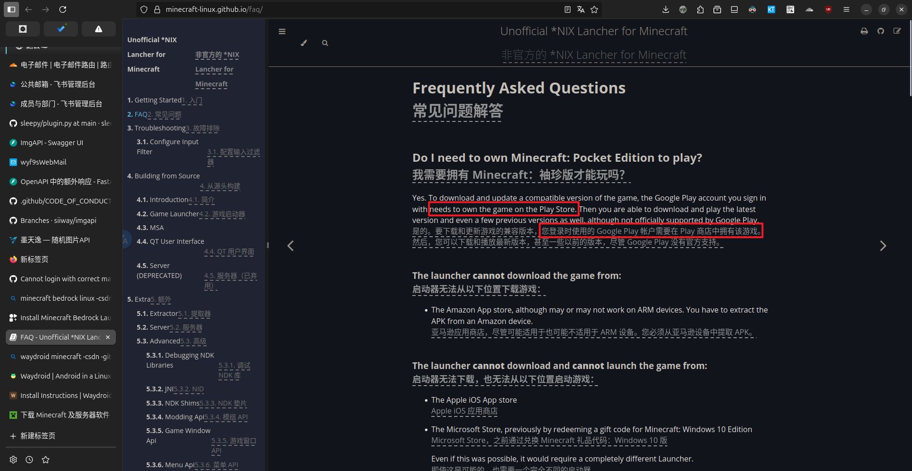
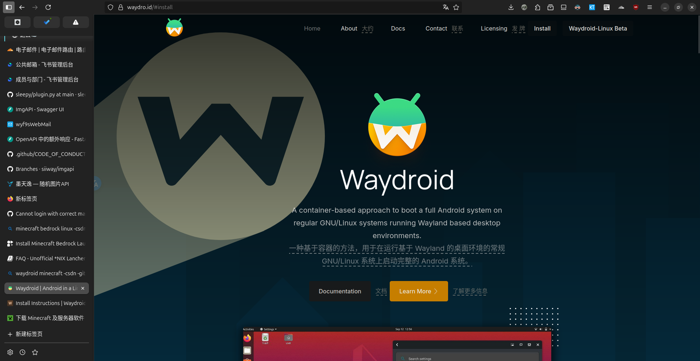
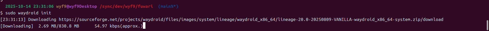
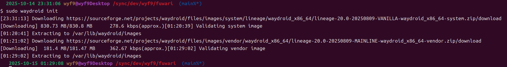
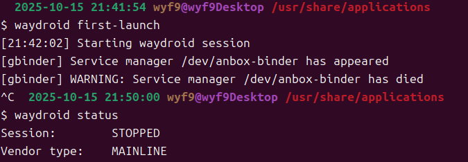
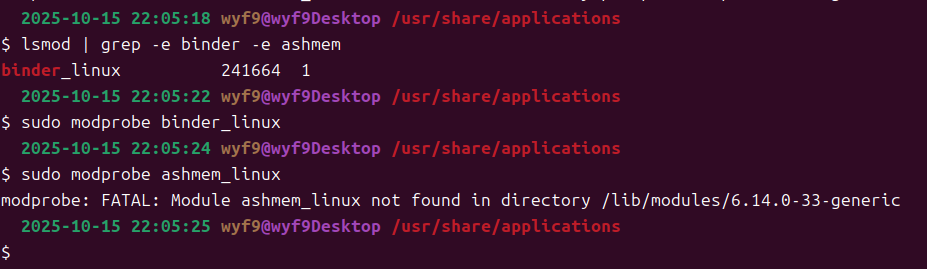

# 前言

在 QQ 群里看到有群友在玩基岩版服务器，我就在想：

**能不能在 Linux 上玩基岩版 MC 呢？**

答案是：**可以！**

## Flatpak (放弃)

https://flathub.org/en/apps/io.mrarm.mcpelauncher



这个方案是我在直接搜索 `minecraft bedrock linux` 时找到的，但它有个严重的问题: **必须拥有 Google Play 版**

因为我的正版是在 MS Store 买的，只好放弃这个方案

> 如果你是在 Google Play 买的基岩版，可以试试

# Waydroid

我换了个思路：可以很轻松地从下载站下载需要的 APK，那能不能在电脑上运行 APK 文件呢?

答案还是：**可以！**



如你所见，Waydroid 是专门用来在 Linux 电脑上运行 Android 软件的容器系统，和 Windows 上的那些安卓模拟器（实际上是虚拟机）相比，Waydroid:

- 开源！
- 和 Linux 无缝集成 (应用菜单)
- 可以切换多窗口模式和全屏模式
- **接近本机的性能**

当然，要获得这么强大的工具，你可能需要做出一项艰难的决定：**放弃 X11**

>顾名思义，Waydroid -> Wayland Android，所以只能在 Wayland 运行 <br/>
>*也可以切换来着? (当我没说)*

既然这么好用，接下来我们就来:

## 安装 Waydroid

如果在用 Ubuntu / Debian / 衍生系发行版，直接三行命令即可:

```bash
sudo apt install curl ca-certificates -y
curl -s https://repo.waydro.id | sudo bash
sudo apt install waydroid -y
```

>[!IMPORTANT]
>其他发行版下载: **https://docs.waydro.id/usage/install-on-desktops#install-instructions**

安装的时候你会疑惑：为什么安装包这么小？

别急，你要手动下载镜像：


```bash
sudo waydroid init
```



如图，下载太慢怎么办？给你两种方案：

1. 自己想办法让它走代理 ~~*(但太晚了我不想试了)*~~
2. 等

睡一觉起来，我们的 Waydroid 安卓镜像就成功下载好了：



## 启动不了怎么办?

如果你执行 `waydroid first-launch` 发现无法启动，提示 `WARNING: Service manager /dev/anbox-binder has died` 或类似提示，如图



这种情况很可能是你的内核不支持 `binder` 和 `ashmem` 模块，可以用下面的命令来测试:

```bash
lsmod | grep -e binder -e ashmem
sudo modprobe binder_linux
sudo modprobe ashmem_linux
```

例如我的内核 (Ubuntu 25.04 默认) 没有 `ashmem` 模块，体现为下图中 `lsmod` 没有 `ashmem_linux` 的输出，尝试加载也提示错误



为了解决这种情况，我们需要安装自定义内核（这里使用 `liquorix`）


## 测试运行 APK

去 https://mt2.cn/download/ 下载 MT 管理器（或其他 APK）

下载完成后 cd 到下载目录，使用 `waydroid app install <FILENAME>` 来安装

如我的安装包名字为 `MT2.19.1.apk`，就执行 `waydroid app install MT2.19.1.apk`