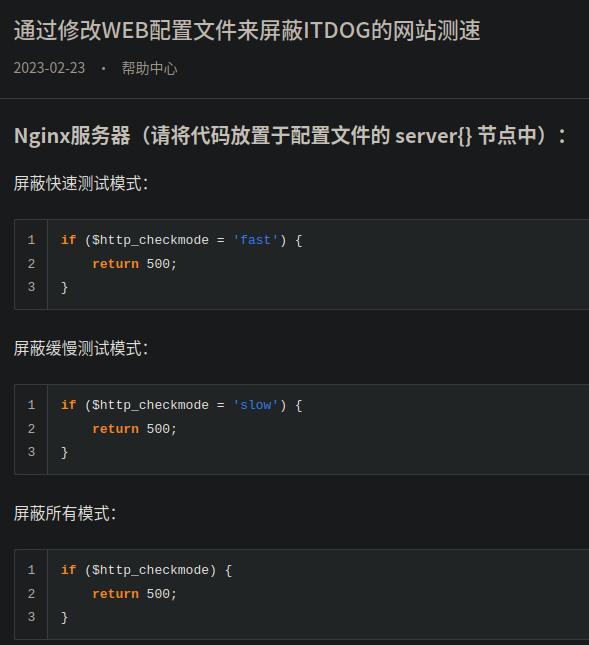
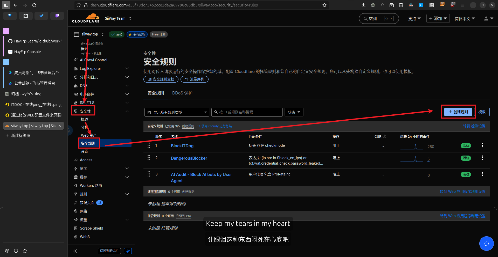
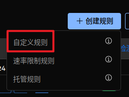
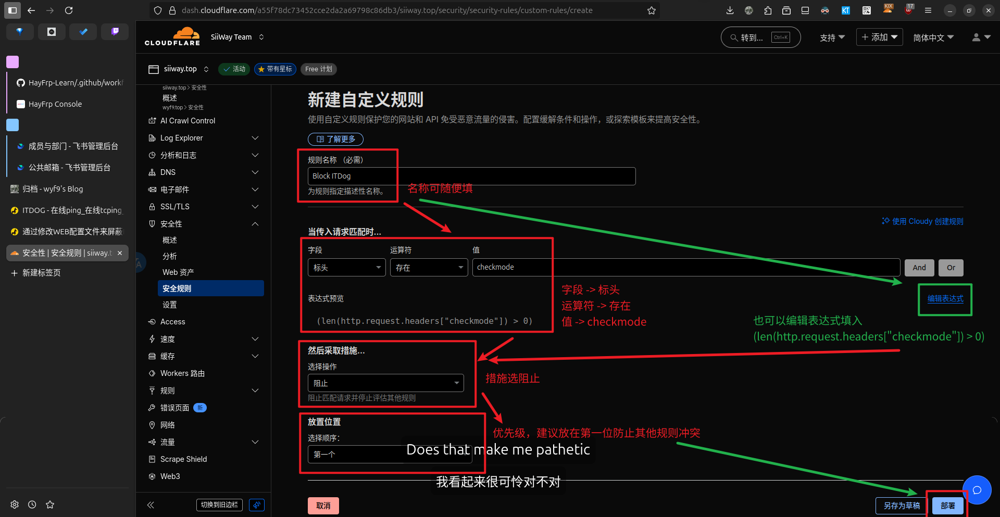
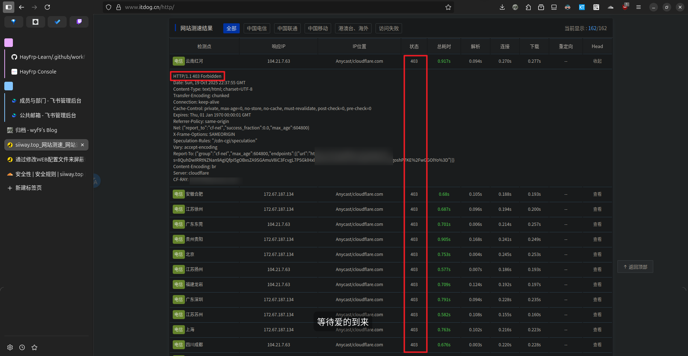

# Block ITDog

>[!TIP]
>From: https://www.itdog.cn/article/content-313.html



如你所见，ITDog 官方文档中的 `$http_checkmode` 指代的其实就是 HTTP 头 `checkmode`，因此不仅是 Nginx，我们可以在很多 CDN 上方便地设置阻止 ITDog 测速 (如 CF WAF 规则)

## Cloudflare

导航到 **`你的域名` -> `安全性` -> `安全规则`**

或者直接跳转: https://dash.cloudflare.com/?to=/:account/:zone/security/security-rules?type=http_request_firewall_custom

点击右上角的 **`创建规则` -> `自定义规则`**




来到规则编辑界面，按下图所示填写，点击 **`部署`** 保存并应用规则



表达式:

```python
# 屏蔽所有模式
(len(http.request.headers["checkmode"]) > 0)
```

```python
# 屏蔽快速测试
(any(http.request.headers["checkmode"][*] eq "fast"))
```

```python
# 屏蔽缓慢测试
(any(http.request.headers["checkmode"][*] eq "slow"))
```

最终效果:



可以看到状态码为 **`403`**，即为被 CF 的防火墙阻止，这时流量就不会到达源服务器了

## Nginx

```nginx
# 屏蔽所有模式
if ($http_checkmode) {
    return 500;
}
```

```nginx
# 屏蔽快速测试
if ($http_checkmode = 'fast') {
    return 500;
}
```

```nginx
# 屏蔽缓慢测试
if ($http_checkmode = 'slow') {
    return 500;
}
```

## IIS & Apache

不放，因为：
1. 本文开头的官方文档链接中有
2. 我不用

## 其他

欢迎评论添加
