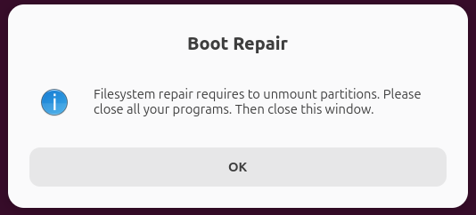

# 前言

凌晨感觉电脑有点卡, 索性输入 reboot 回车, 然后: **炸了**


总之就是进 busybox, exit 回车大概率退不出, 提示图中的 `ALERT! UUID=xxx does not exist. Dropping to a shell!`

这种情况不用怀疑, 就是引导的问题

那么, 如何修复呢?

# 安装 boot-repair

修复很简单, 只需要使用 YannUbuntu 大佬的 boot-repair 工具修复即可


首先, 你需要准备一个 **Ubuntu** 系统的 Live USB / CD, 从其中启动 (因为原系统一般已无法引导, 也可使用 Ventoy)

进入 Live CD 系统后, 关掉安装窗口, 在开始菜单找到 **Terminal (终端)** 打开

这个工具在 Launchpad PPA 中有提供, 所以可以用简单的两行命令下载安装:

```bash
# 添加 PPA Repo
sudo add-apt-repository ppa:yannubuntu/boot-repair
# 很多人说这里需要手动 update, 但实测 add-apt-repository 会自动帮我们更新
# sudo apt update
# 安装
sudo apt install boot-repair
```


## 没网怎么办?

手动下载 boot-repair 的 deb 文件: https://launchpad.net/~yannubuntu/+archive/ubuntu/boot-repair/+packages


展开一个 Package, 找到其 **Package Files** 并下载全部以 `.deb` 结尾的文件, 放在一个文件夹中, 并想办法搞到 LiveCD 系统中使用 **`sudo apt install ./*.deb`** 安装即可

## 不是 Ubuntu 系统?

即使你硬盘上的系统不是 Ubuntu, 也可以使用 Ubuntu LiveCD + 此工具 修复引导:


或者, 你可以到它的主页 https://sourceforge.net/p/boot-repair/home/cn/ 查找其他系统版本

> [!IMPORTANT]
> 注意: boot-repair 只能在 livecd 环境中启动, 在本地系统无效

# 修复引导

启动 boot-repair:


```bash
sudo boot-repair
```

首先回答一个问题: `Is there RAID on this computer?`


如不知道直接 `No`, 建议看实际情况选择

接下来, 等待扫描 (~1min):


进入主界面, 首先点击 `Advanced options`, 勾选 **`Repair file systems`**


> [!TIP]
> 如系统没有网络 / 不需要上传到 Pastebin, 可以在 Other options 取消勾选相关设置, 加快完成速度

> [!IMPORTANT]
> 建议点 `Backup partition tables, bootsectors and logs` 备份分区表等信息到其他磁盘

然后直接点击 **`Apply`** 应用更改, 需要在弹出下图窗口时关掉其他软件 (因为会临时卸载磁盘)



等待修复 (一般不超过 5 分钟)


出现下图提示即为修复成功, 可重启电脑查看效果


> [!TIP]
> 建议复制关闭窗口后打开的日志, 如出现问题可发邮件到 **[boot.repair[@]gmail.com](mailto:boot.repair@gmail.com)** 反馈