Linux DO: https://linux.do/t/topic/1091998

# 知周所众

Cloudflare Tunnel 可以用来把你本地的**网站**映射到公网 (前提是你的域名已经添加到 Cloudflare)

那 **SSH / TCP** 呢? **当然可以！**

但既然都是手把手教程了，我们就从头开始讲起：

# 安装 Cloudflared

Cloudflared 是 Cloudflare Tunnel 的客户端，必须在服务器上安装它才能穿透你的服务 (如果穿透 SSH / TCP 还得在客户端安装)

打开它的 [Releases 页面](https://github.com/cloudflare/cloudflared/releases/latest)，然后选择你系统的客户端 

几种常见的：

- Windows: `cloudflared-windows-amd64.exe`
- Debian / Ubuntu: `cloudflared-linux-amd64.deb`
- Linux 通用: `cloudflared-linux-amd64`
- Mac: `cloudflared-darwin-amd64.tgz`

# 配置隧道

安装完成后打开 Cloudflare Zero Trust Dashboard:

https://one.dash.cloudflare.com/

导航到 `网络` (`Network`) -> `Tunnels`，点击 `创建隧道`

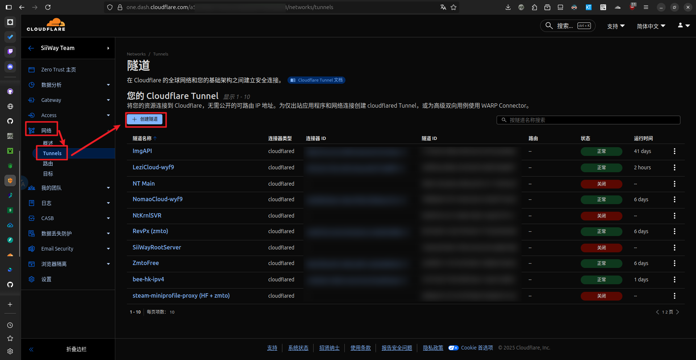

选择 `Cloudflared`:

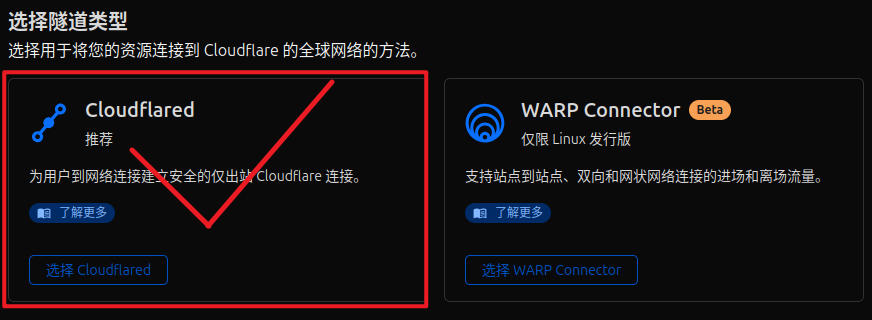

随便填一个名称，保存:

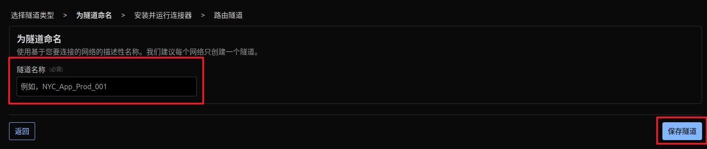

来到 `安装并运行连接器`，选择你的服务器系统，复制安装服务命令并在服务器上执行:

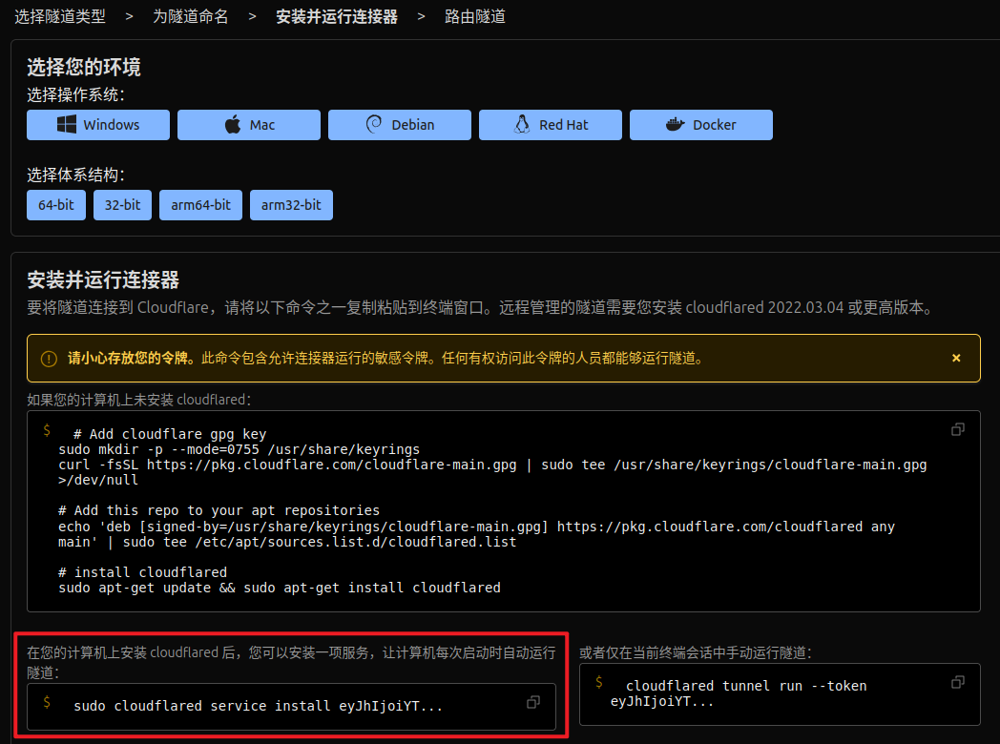

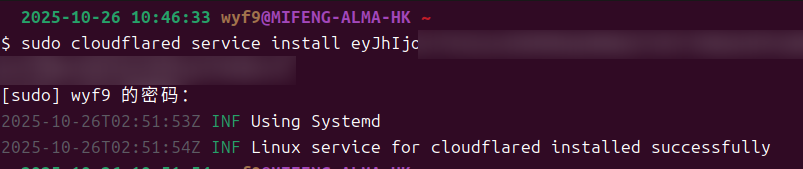

安装完成后，`Connectors` 应该会出现你的机器，这时就可以继续了

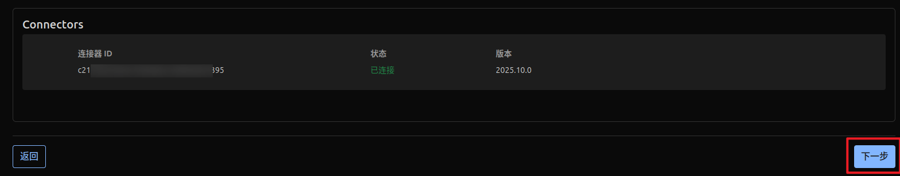

# 穿透你的服务

## HTTP 网站

如果你的服务监听 `localhost:12345`，想用 `example.wyf9.top` 访问，就可以按下面的图片配置:

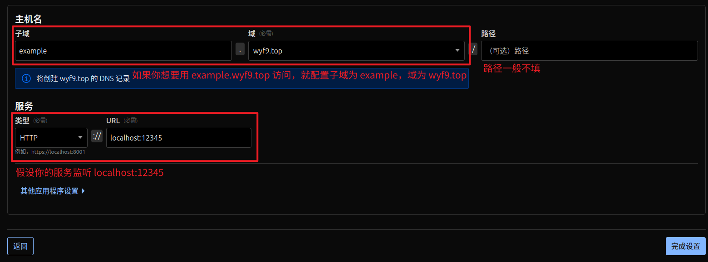

## SSH 服务

假设你的 sshd 监听 `localhost:22`，想用 `example-ssh.wyf9.top` 访问，按下面的图片配置:

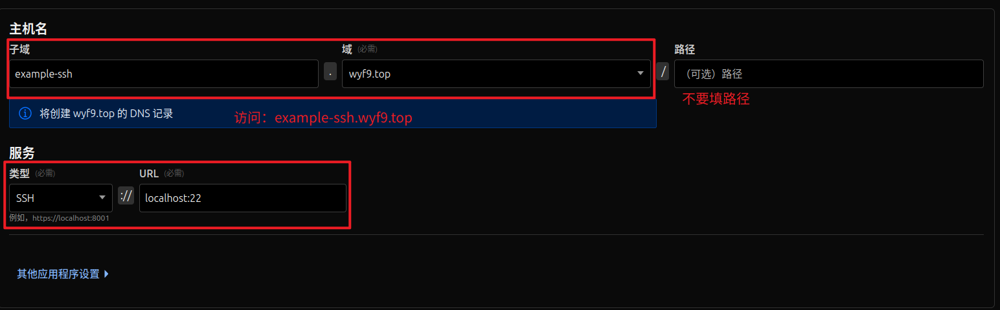

注意不能直接用浏览器访问，需要先在客户端安装 Cloudflared，并编辑你的 SSH 配置文件

- Windows: `C:\Users\你的用户名\.ssh\config`
- Linux: `/home/你的用户名/.ssh/config` *(root 是 `/root/.ssh/config`)*

增加以下内容:

```
# ~/.ssh/config
Host ALIAS
    Hostname HOSTNAME
    ProxyCommand cloudflared access ssh --hostname %h
    User USER
```

将 `ALIAS` 替换为你连接时想要使用的别名，`HOSTNAME` 替换为你在上面配置的主机名，`USER` 替换为你在机器上的用户，保存退出

>比如我的配置如下:

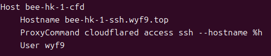

配置好后，以后即可使用 `ssh HOSTNAME` 连接:

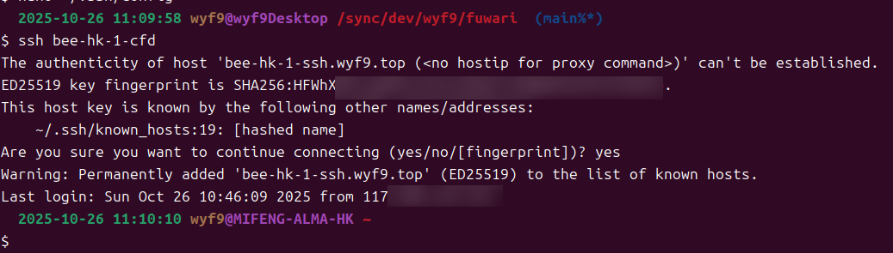

>也可以去 Cloudflare Access 配置 WebSSH，但我没有绑信用卡所以不讲

## TCP 服务

假设你的服务监听 `localhost:9876`，想用 `example-tcp.wyf9.top` 访问，按下图配置：

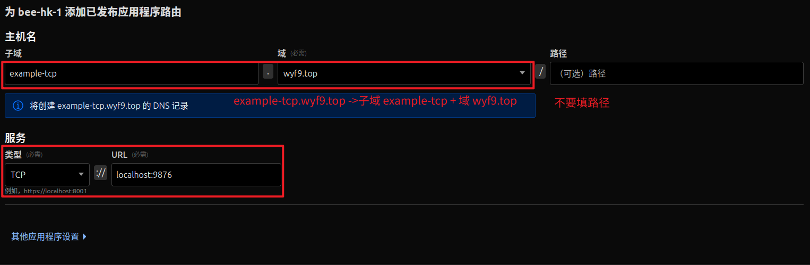

同样不能用浏览器直接访问，需要在客户端执行下面的命令打开隧道:

```bash
cloudflared access tcp --hostname example-tcp.wyf9.top --url localhost:9876
```

把 `example-tcp.wyf9.top` 替换为你的主机名，`localhost:9876` 替换为客户端监听的地址 (可以和服务器不同)

<details>

<summary>测试服务器搭建</summary>

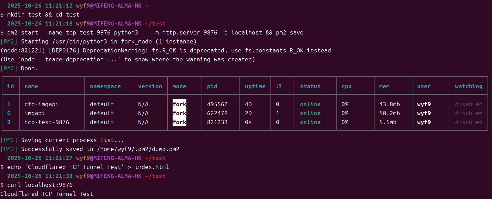

</details>

测试效果:

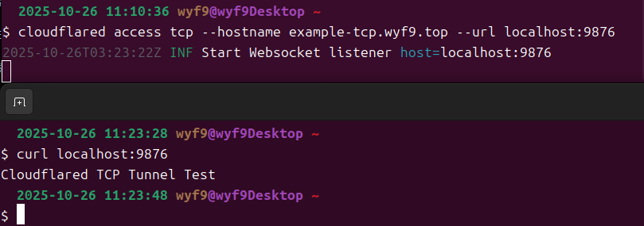

>`example-tcp.wyf9.top` 是真实服务，可以用来测试你的 Cloudflared 能否使用 <br/>
>你问我为什么是 HTTP? 因为 HTTP 1/2 本质上也是 TCP 服务器，以及我一时间想不到好的 TCP 服务用来演示了 <br/>
>*如果服务掉了请 [联系我](https://wyf9.top/c)*

# Ref

Cloudflare 官方教程:

- [SSH](https://developers.cloudflare.com/cloudflare-one/networks/connectors/cloudflare-tunnel/use-cases/ssh/)
- [RDP](https://developers.cloudflare.com/cloudflare-one/networks/connectors/cloudflare-tunnel/use-cases/rdp/)
- [SMB](https://developers.cloudflare.com/cloudflare-one/networks/connectors/cloudflare-tunnel/use-cases/smb/)
- [gRPC](https://developers.cloudflare.com/cloudflare-one/networks/connectors/cloudflare-tunnel/use-cases/grpc/)
