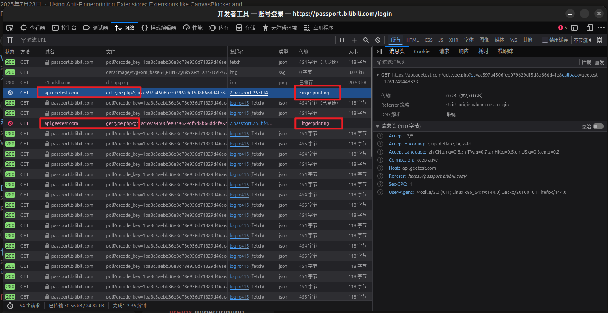
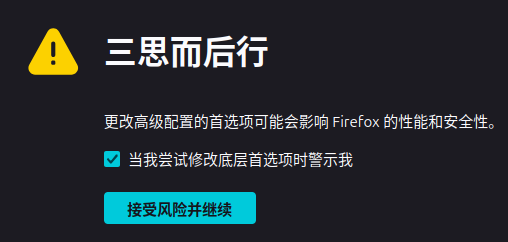
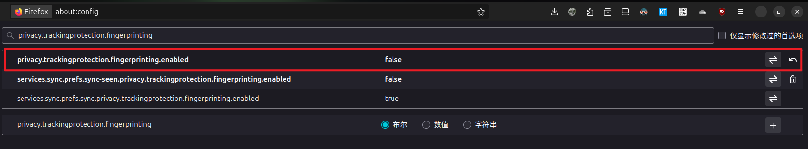

# 前言

在 Firefox 上的网页端 B 站尝试登录，发现不管是 帐号密码模式 的 登录 按钮还是 验证码模式的 发送验证码 按钮都没反应

我起初以为是美化插件的问题，但禁用后依旧，我又立马想到可以在开发者工具的网络面板查看请求

# Fingerprinting

不看不知道，一看吓一跳：

可以看到网络面板中 `api.geetest.com` (极验) 的请求发送失败，传输一栏显示 **`Fingerprinting`**

# 解决方法

打开 `about:config`，点击 `接受风险并继续`

搜索 `privacy.trackingprotection.fingerprinting`，如果 `privacy.trackingprotection.fingerprinting.enabled` 的值为 `true`，将其改为 `close`:

刷新网页，重新点击 `登录` / `发送验证码`，这时应该就能正常登录了

# Ref

https://support.mozilla.org/zh-CN/kb/resist-fingerprinting

但貌似不是我的配置项 (?)