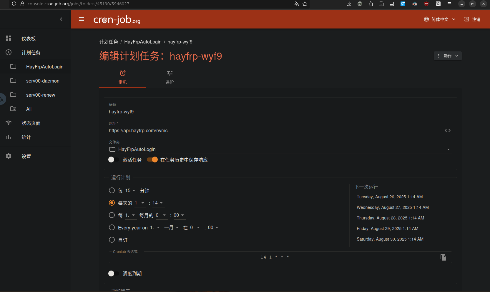
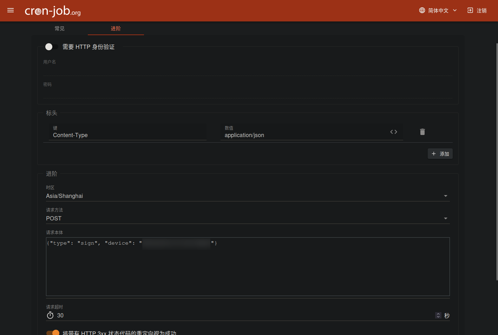
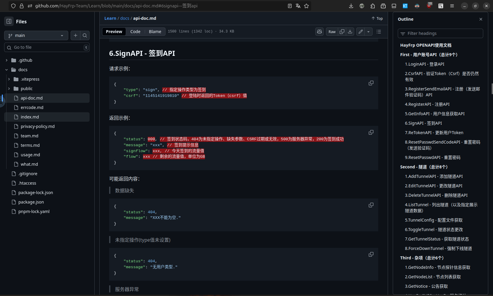
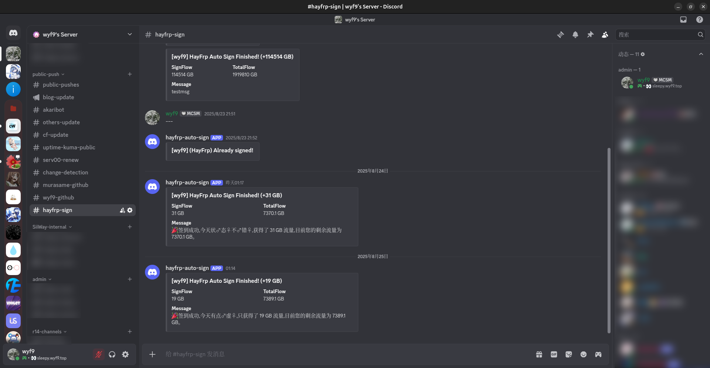
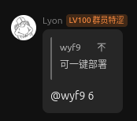
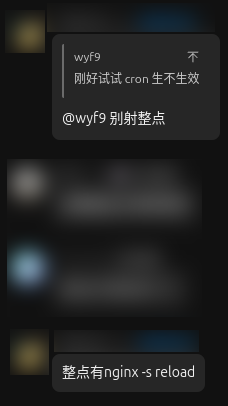

## 省流

::github{repo="wyf9/hayfrp-auto-sign"}

## 起因

几个月前, HayFrp 站长在交流群中说可以用设备的 `rwmc_key` 来直接执行签到, 于是我在 cron-job.org 创建了一个计划任务来每天自动签到:

但是我发现了这种方式的缺点

- **无法第一时间知道签到结果** (除非执行失败)
- 不方便获取 rwmc key (需要下载客户端)

## 于是

- 坏消息: learn.hayfrp.com 寄了

- 好消息: 我在 GitHub 上找到了 HayFrp 的 API 文档:

::github{repo="HayFrp-Team/Learn"}

> URL: https://github.com/HayFrp-Team/Learn/blob/main/docs/api-doc.md#6signapi---%E7%AD%BE%E5%88%B0api

最终, 经过一番对 Cloudflare Workers 的深入研究, 我写出了这个项目:

::github{repo="wyf9/hayfrp-auto-sign"}

主要的功能就是在每天 *1:14* 自动签到, 并将结果通过 Webhook 推到 Discord

> *实际上 DC Webhook 比 TG Bot 方便, 注册还简单, 环境还好, [所以快给我用!!!!!!!!!!](https://discord.com)*

效果图:

> *你问为什么第一天是 1:17? 因为我把 cron 表达式里的 UTC 默认成了 CST, 发现之后紧急改的(*

> [!WARNING]
> 如果需要自行修改执行时间, **请不要选择整点**, 因为:

