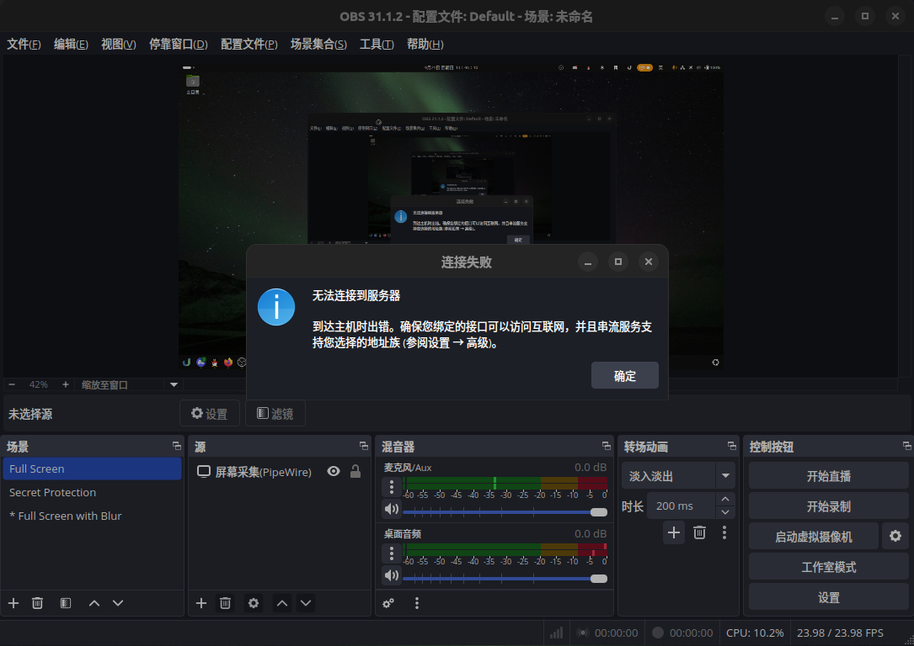
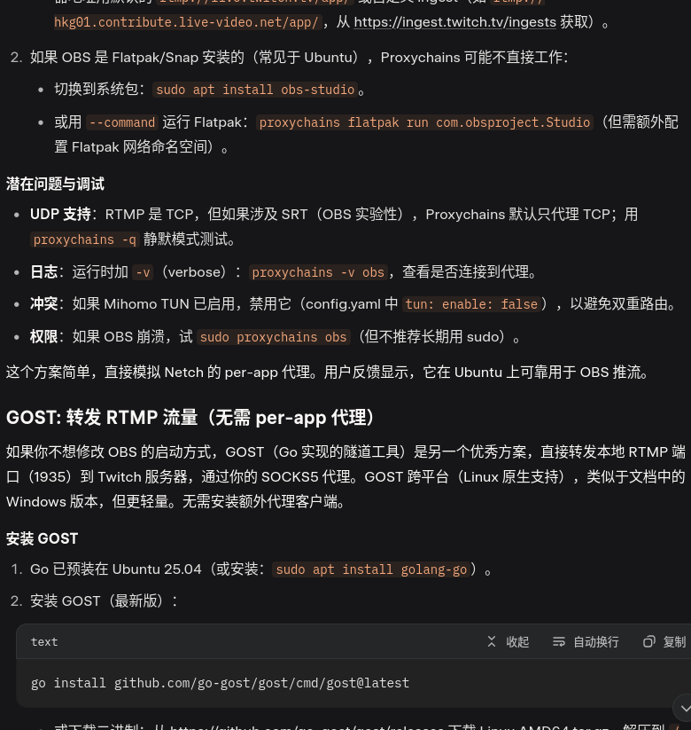
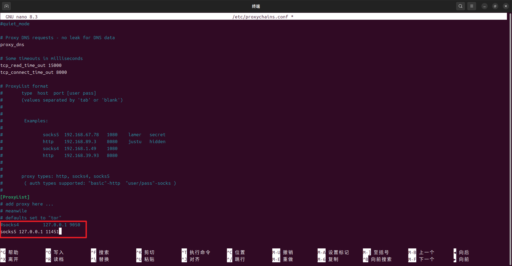
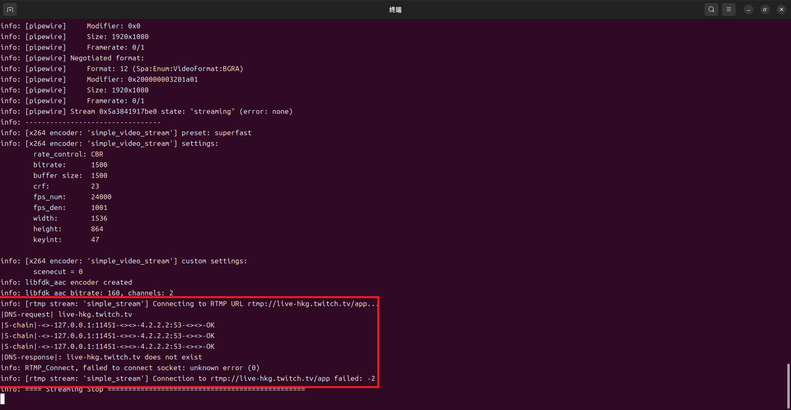
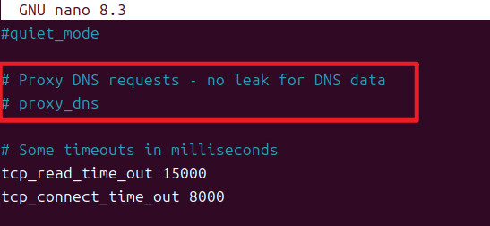
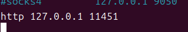
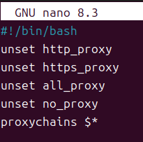
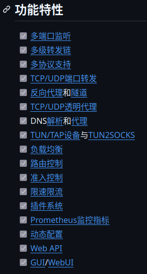
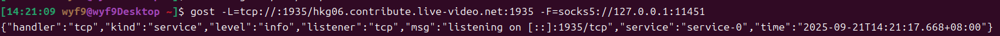
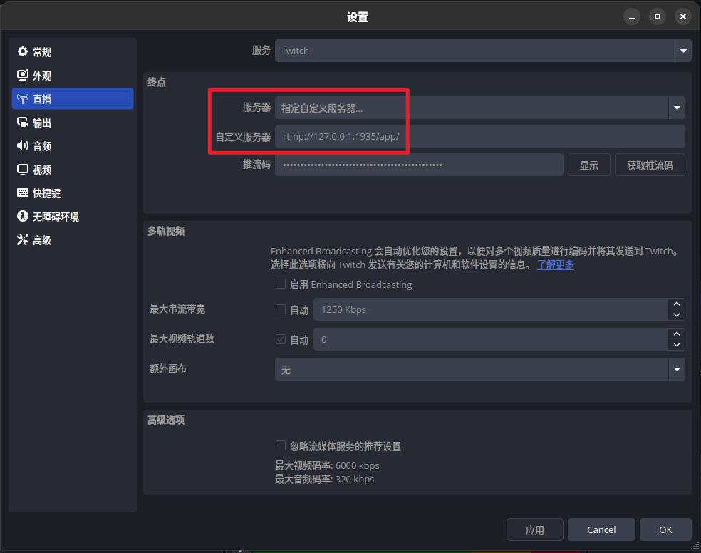

# 前言

> *可直接跳转到: [# (成功) GOST](#成功-gost)*

最近因为 Clash Verge 占用太大, 切换到了 Mihomo Core, 但发现 OBS 直播连不上了:



但问题是: 我既开了系统代理, 也开了 TUN (`tun: enable: true`), **但 OBS 就是不用**

在询问 Grok 后, 我得到了两种方案: **Proxychains** 和 **GOST**



> [!TIP]
> https://grok.com/share/c2hhcmQtNA%3D%3D_22494f12-c044-4fcb-9b48-0ca6dfed06e1

# (失败) Proxychains

既然 Grok 都说它是最流行的代理工具了, 当然要试试

安装很简单:

```bash
sudo apt update
sudo apt install proxychains -y
```

接下来编辑 `/etc/proxychains.conf` (替换 `11451` 为你的混合代理端口):



一切进行得很顺利, 使用 `proxychains obs` 启动, 然后炸了:



我先后尝试了四种方式解决:

1. 关掉 Proxy DNS requests



2. 改成 HTTP 代理



3. 取消环境变量 (`xxx_proxy`)



4. 关掉 TUN

无果, 只好放弃这个方案.

## (成功) GOST

::github{repo="go-gost/gost"}

GOST 是用 Go 编写的安全隧道软件, 国人维护, 有很多代理相关的功能:



首先打开 **[Releases](https://github.com/go-gost/gost/releases/latest)**, 下载你系统版本的压缩包

解压并将 `gost` 复制到 `/usr/bin/`

```bash
tar -zxvf gost_3.2.4_linux_amd64.tar.gz # 3.2.4 -> your version
rm LICENSE README.md README_en.md
sudo mv gost /usr/bin/
```

使用下面的命令启动隧道:

```bash
gost -L=tcp://:1935/hkg06.contribute.live-video.net:1935 -F=socks5://127.0.0.1:11451
```

> [!IMPORTANT]
> 替换 `:11451` 为你的 soocks 监听端口
> 直播 rtmp 服务器地址 (Twitch) 在 https://ingest.twitch.tv/ingests 查找

> 看到如下提示即为成功启动



接下来, 打开 OBS 设置 -> 直播

- **服务器**改为 `指定自定义服务器...`
- **自定义服务器**改为 `rtmp://127.0.0.1:1935/app/`



保存设置, 点击 `开始直播` 应该就能正常串流了
