## 缘由

> 前情提要: [合并歌词脚本](./mix-lyrics.md)

知周所众, 我下载音乐的工作流是这样的:

```mermaid
graph TB
    A[B 站手机客户端缓存视频] --> B[adbfs 挂载到电脑]
    B --> C[wyf9/music 脚本提取出 mp3 文件]
    C --> D["**MusicPlayer2 下载封面 & 歌词**"]
    C --> E[从 Waylyrics 查找并下载歌词]
    E --> H[手动下载封面]
    C --> F[从网上手动下载封面 & 歌词]
    D --> G["git add && git commit -S && git push"]
    H --> G
    F --> G
```



问题就出在了**从 MusicPlayer2 下载歌词**这一步

MusicPlayer2 从网易云源下载歌词:


因此, 下载到的歌词是 **`[时间戳]原文 / 译文`** 的格式, 而这种格式**很多软件都无法识别**, 会直接当作单语歌词来处理:


如你所见, 上面 MusicPlayer2 的编辑歌词界面中也有互转选项, 但是 **太麻烦**, 于是我在两个库 + Grok 的帮助下写出了这个拆分歌词的脚本.

## 代码

<details>

<summary>点击展开</summary>

```py
# main.py
# coding: utf-8

import os
from copy import deepcopy

from mutagen.id3 import ID3
from mutagen.id3._frames import USLT
from pylrc import parse
from pylrc.classes import LyricLine
from charset_normalizer import detect
from colorama import Fore

from utils import *


def help(code: int = 0):
    print('''
Usage:
  - main.py <mode> <path>
  - main.py <mode> <path> <prefix>
  - main.py <mode> <path> <prefix_start> <prefix_end> [prefix_spliter]
    * contains prefix_start and prefix_end
    * perfix_spliter is _ by default
''')
    exit(code)


def ms_to_tag(line: LyricLine) -> str:
    return f'{line.minutes:02d}:{line.seconds:02d}.{line.milliseconds:03d}'


def extract_lyrics(id3: ID3) -> tuple[str | None, str]:
    try:
        uslt_frames = id3.getall('USLT')
        if not uslt_frames:
            return None, "No lyrics (USLT) tag found"

        lyrics = uslt_frames[0].text
        return lyrics, f"Found lyrics (lang: {uslt_frames[0].lang}, description: {uslt_frames[0].desc})"

    except Exception as e:
        return None, f"Error reading ID3 tags: {e}"


def edit_lyrics(id3: ID3, lrc: str) -> tuple[bool, str]:
    try:
        uslt_frames = id3.getall('USLT')
        if not uslt_frames:
            return False, "No lyrics (USLT) tag found"
        lang = uslt_frames[0].lang
        desc = uslt_frames[0].desc
        id3.delall('USLT')
        id3.add(USLT(lang=lang, desc=desc, text=lrc))
        # 保存更改
        id3.save()
        return True, "Lyrics successfully written to USLT tag"
    except Exception as e:
        return False, f"Error writing lyrics to ID3 tags: {e}"


def process(filename: str, mode: str) -> tuple[bool | None, str]:
    # get lyrics
    if mode == 'mp3':
        id3 = ID3(filename)
        lrc, desc = extract_lyrics(id3)
        if not lrc:
            return False, desc
        lrc = lrc.replace('\n', '')
        debug(f"* Read mp3 tag content (first 50 chars): {lrc[:50].replace('\n', f'{Fore.CYAN}\\n{Fore.BLUE}')}")
    else:
        try:
            with open(filename, 'rb') as f:
                raw_data = f.read()
                encoding_result = detect(raw_data)
                encoding = encoding_result.get('encoding')
                confidence = encoding_result.get('confidence')
                debug(f"* Detected encoding: {encoding} (confidence: {confidence})")

            if encoding is None:
                return False, f"Unable to detect encoding for {filename}"

            with open(filename, 'r', encoding=encoding) as f:
                lrc = ''.join(f.readlines())
            debug(f"* Read lrc content (first 50 chars): {lrc[:50].replace('\n', f'{Fore.CYAN}\\n{Fore.BLUE}')}")
        except UnicodeDecodeError as e:
            return False, f"Failed to read file with encoding {encoding}: {e}"
        except Exception as e:
            return False, f"Error reading file: {e}"

    # check if need split
    if not lrc.find(' / ') > 10:
        return None, ''

    # process lyrics
    lyric = parse(lrc)
    new = deepcopy(lyric)
    new.clear()

    i = 0
    line: LyricLine
    while i < len(lyric):
        try:
            line = lyric[i]
            if ' / ' in line.text:
                origline = deepcopy(line)
                tranline = deepcopy(line)
                orig, tran = line.text.split(' / ', 1)
                origline.text = orig.lstrip(' ').rstrip(' ')
                tranline.text = tran.lstrip(' ').rstrip(' ')
                new.append(origline)
                new.append(tranline)
            else:
                new.append(line)
            i += 1
        except IndexError:
            break

    # write file
    if mode == 'mp3':
        edit_lyrics(id3, new.toLRC())
        id3.save()
    else:
        with open(filename, 'w', encoding='utf-8') as f:
            f.write(new.toLRC())

    return True, ''


def main():
    # show help
    if '--help' in argv:
        help()

    # --- get args
    p = perf_counter()
    mode = getargv(1)
    assert mode, 'Please provide a mode at param #1!'
    assert mode == 'mp3' or mode == 'lrc', 'Invaild mode, it should be mp3 or lrc!'
    path = getargv(2)
    assert path, 'Please provide a path at param #2!'
    assert os.path.isdir(path), 'Path isn\'t exist!'
    arg3 = getargv(3)
    arg4 = getargv(4)
    prefix_mode = 0  # no prefix
    if arg3:
        if arg4:
            try:
                prefix_start = int(arg3)
                prefix_end = int(arg4)
                prefix_spliter = getargv(5) or '_'
                prefix_mode = 2  # number range
            except:
                raise AssertionError('Prefix start / end isn\'t number!')
        else:
            prefix: str = arg3
            prefix_mode = 1  # str prefix
    debug(f'* get args took {p()}ms')

    # --- get files
    p = perf_counter()
    raw = os.listdir(path)
    log(f'All files and folders: {len(raw)}')
    files = []
    debug(f'* prefix mode: {prefix_mode}')
    for f in raw:
        if f.endswith(mode):
            if prefix_mode == 1:
                if f.startswith(prefix):
                    files.append(f)
            elif prefix_mode == 2:
                pref = f.split(prefix_spliter, 1)[0]
                if not pref:
                    continue
                try:
                    pref = int(pref)
                    if prefix_start <= pref <= prefix_end:
                        files.append(f)
                except ValueError:
                    continue
            else:
                files.append(f)
    debug(f'* get files took {p()}ms')
    log(f'Files filtered: {len(files)} - {files}')

    # --- process file
    for f in files:
        p = perf_counter()
        try:
            success, msg = process(os.path.join(path, f), mode=mode)
            if success is None:
                log(f'processing {f}: not needed')
            elif success:
                log(f'process {f} success')
            else:
                warn(f'processing {f} error: {msg}')
        except Exception as e:
            warn(f'processing {f} error: {e}')
        debug(f'* process {f} took {p()}ms')

    log('Finished!')


if __name__ == "__main__":
    try:
        main()
    except AssertionError as err:
        error(' '.join(err.args))
        help(1)
```

```py
# utils.py
# coding: utf-8
from sys import argv
from time import perf_counter as __perf_counter

from colorama import Fore, Style


def getargv(key: int, default: str | None = None):
    try:
        return argv[key]
    except IndexError:
        return default


def perf_counter():
    '''
    获取一个性能计数器, 执行返回函数来结束计时, 并返回保留两位小数的毫秒值
    - copied from sleepy utils.py 😋
    '''
    start = __perf_counter()
    return lambda: round((__perf_counter() - start)*1000, 2)


def log(*content):
    print(f'{Fore.GREEN}{" ".join(str(c) for c in content)}{Style.RESET_ALL}')


def debug(*content):
    print(f'{Fore.BLUE}{" ".join(str(c) for c in content)}{Style.RESET_ALL}')


def warn(*content):
    print(f'{Fore.YELLOW}{" ".join(str(c) for c in content)}{Style.RESET_ALL}')


def error(*content):
    print(f'{Fore.RED}{" ".join(str(c) for c in content)}{Style.RESET_ALL}')
```

```toml
# pyproject.toml
[project]
name = "split-multilang-lyric"
version = "0.1.0"
requires-python = ">=3.13"
dependencies = [
    "charset-normalizer>=3.4.3",
    "colorama>=0.4.6",
    "mutagen>=1.47.0",
    "pylrc>=0.1.2",
]
```

</details>

> 同样已经上传到 [GitHub (`split_multilang_lyric` 目录)](https://github.com/wyf9/lrc-tools/tree/main/split_multilang_lyric)

::github{repo="wyf9/lrc-tools"}

## 如何使用

有三种使用方式:

1. `python3 main.py` `<mode>` `<path>`

`mode` 可选 `mp3` / `lrc`, 对**指定目录** (`<path>`) 中**此后缀** (`<mode>`) 的文件进行处理 *(不会扫描子目录)*

2. `python3 main.py` `<mode>` `<path>` `<prefix>`

同上, 但是增加筛选条件: 文件名必须以**指定的前缀** (`<prefix>`) 开头

3. `python3 main.py` `<mode>` `<path>` `<prefix_start>` `<prefix_end>` `[prefix_spliter]`

同 `1.`, 但是增加筛选条件: 文件名必须**以 `<prefix_start>` 和 `<prefix_end>` 区间内的数字 + `[prefix_spliter]` *(默认为 `_`)* 开头**

比如你执行 `python3 main.py mp3 ./ 1 3` (`1` - `3`), 文件夹中有以下文件:

```
1_617700852_Shadow Of The Sun.mp3
1_617700852_Shadow Of The Sun.lrc
2_676186170_See You Again.mp3
2_676186170_See You Again.lrc
3_549442278_Far Away From Home.mp3
4_85054372_溯.mp3
5_400766871_平凡之路.mp3
```

则会匹配到以下文件:

```
1_617700852_Shadow Of The Sun.mp3
2_676186170_See You Again.mp3
3_549442278_Far Away From Home.mp3
4_85054372_溯.mp3
5_400766871_平凡之路.mp3
```

<details>

<summary>Usage</summary>

```md
Usage:
  - main.py <mode> <path>
  - main.py <mode> <path> <prefix>
  - main.py <mode> <path> <prefix_start> <prefix_end> [prefix_spliter]
    * contains prefix_start and prefix_end
    * perfix_spliter is _ by default
```

</details>

## End

**Enjoy!**