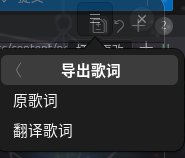
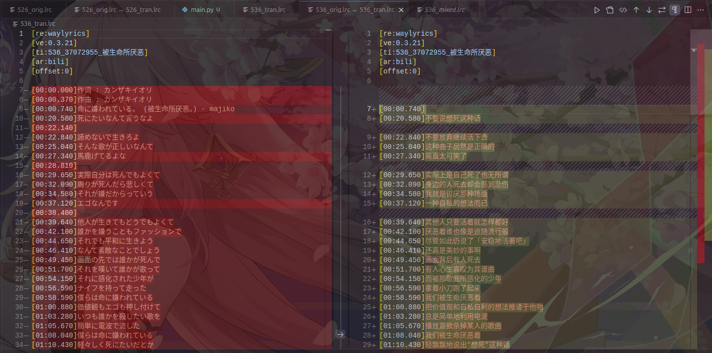
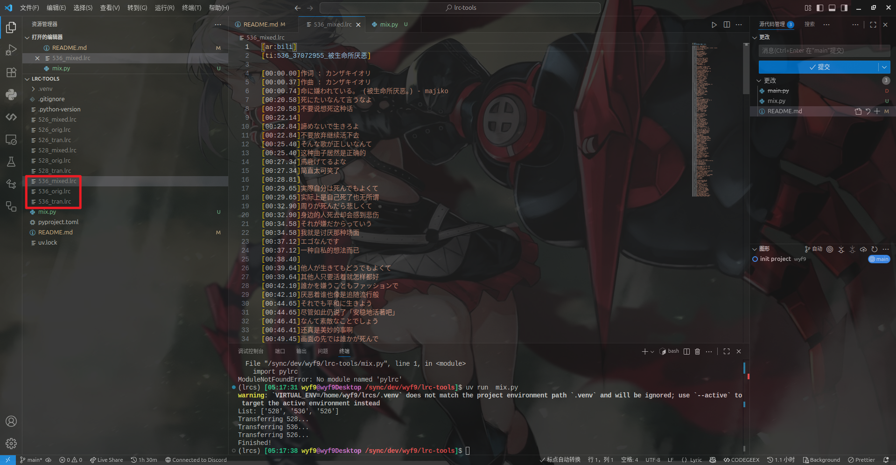

# 起因

最近在使用 Waylyrics 配合 Audacious 显示歌词, 偶然间发现它的歌词源比 MusicPlayer2 要更加丰富, 但是只能分别导出原始歌词和翻译后歌词:



导出的歌词内容:



> 左为原歌词, 右为翻译后歌词

## 于是

我就写了这样的一个小脚本:

> 已经上传到 [GitHub](https://github.com/wyf9/lrc-tools/blob/main/mix_lyrics/main.py)

::github{repo="wyf9/lrc-tools"}

<details>
<summary>点击展开代码</summary>

```py
import pylrc
from pylrc.classes import Lyrics, LyricLine
import os


def load_lrc(fname: str) -> Lyrics:
    with open(fname, 'r', encoding='utf-8') as f:
        lrcstr = ''.join(f.readlines())
        return pylrc.parse(lrcstr)


def get_lst() -> list[str]:
    lst = []
    filelst = os.listdir('.')
    for fname in filelst:
        if fname.endswith('_orig.lrc'):
            if fname[:-9] + '_tran.lrc' in filelst:
                lst.append(fname[:-9])
    return lst

def ms_to_tag(line: LyricLine) -> str:
    return f'{line.minutes:02d}:{line.seconds:02d}.{line.milliseconds:03d}'

def find_match(lyrics: Lyrics, time: str | LyricLine) -> LyricLine | None:
    if isinstance(time, LyricLine):
        time = ms_to_tag(time)
    for i in range(len(lyrics)):
        if ms_to_tag(lyrics[i]) == time and lyrics[i].text != '':
            return lyrics[i]
    return None

def transfer(fname: str) -> None:
    orig = load_lrc(f'{fname}_orig.lrc')
    tran = load_lrc(f'{fname}_tran.lrc')
    mixed = load_lrc(f'{fname}_orig.lrc')

    mixed.clear()

    i = 0
    while i < len(orig):
        try:
            mixed.append(orig[i])
            match = find_match(tran, orig[i])
            if match:
                mixed.append(match)
        except IndexError:
            pass
        i += 1
    result = mixed.toLRC()
    with open(f'{fname}_mixed.lrc', 'w', encoding='utf-8') as f:
        f.write(result)


if __name__ == '__main__':
    lst = get_lst()
    print(f'List: {lst}')
    for i in lst:
        print(f'Transferring {i}...')
        transfer(i)
    print('Finished!')
```

</details>

使用也很简单, 只需要把原始歌词 (以 `_orig.lrc` 结尾) 和翻译后歌词 (以 `_tran.lrc` 结尾) 放在同一目录下, 运行脚本即可

运行后会自动在同目录下输出以 `_mixed.lrc` 结尾的歌词文件, 为混合后的结果 (原始歌词在前, 翻译后歌词在后)

## 效果


