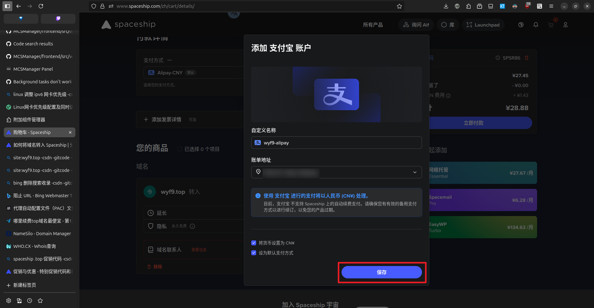

# 前言

如图:

话不多说, 正式开始转出流程!

# 解锁域名

> [!TIP]
> 如果域名已解锁 (状态为 `ok`) 可**跳过此步骤**

首先转到 [Namesilo 官网](https://www.namesilo.com), 右上角登录后找到 **`Domain Manager`** 或直接打开:

https://www.namesilo.com/account_domains.php

接下来找到你要转出的域名, **点击域名名称** 进入控制台:

拉到页面底部, 找到 **`Domain Lock`** 点击切换:

操作完成后稍等几秒, 再查询域名状态可以发现之前的 `clientTransferProhibited` 变成了 **`ok`**, 完成解锁

# 获取转移码

在刚刚解锁域名处上面找到 `Authorization Code`, 点击右边的 **`Send Email`** 发送带转移码的邮件:

弹出 `Oh no! What's leading you to transfer out`, 可直接点 `Skip` 跳过评价:

等待几秒, 应该就会收到含转移码的邮件, 复制其中的转移码:

# 在 Spaceship 转入域名

打开 https://www.spaceship.com/zh/domain-transfer-submit/

1. 在上面的输入框输入你的域名, 点击 **`转移`**
2. 输入上面邮件中的授权码 *(稍等两秒, 右边的 `注册商锁定` 状态应变为 `已解锁`)*
3. 点击 **`添加到购物车`**

## 使用优惠码

> [!TIP]
> 如果非 Spaceship 新用户 *(或找不到你域名后缀的优惠码)* 可跳过此段, 直接点击 `结账` *(老用户不适用大部分优惠码)*

打开 https://www.spaceship.com/zh/promos, 并找到你的域名后缀, 复制优惠码 (如 `.top` 在 2025-09-04 写文时为 **`SPSR86`**):

接下来, 在弹出的购物车菜单中点击 `添加促销代码`, 输入上面获取到的优惠码, 并点击上方的 **`注册`** (如已有账号则登录):

登录后点击右上角用户头像左侧 **🛒** 图标, 重新打开购物车菜单, 并重新粘贴优惠码点击 **`应用`**, 应用成功后点击结账

> [!IMPORTANT]
> 如果提示 `检测到VPN或代理`, 请 **临时关掉代理软件**, *或给 `spaceship.com` 及其子域名添加直连规则*

# 结账流程

来到结账页面, 首先找到 **`添加支付方式`**, 选择可用的支付方式添加

> [!IMPORTANT]
> 国内建议使用支付宝, **不支持微信支付!!!**

支付宝开通代扣成功后会自动重定向, 并提示你增加一个账单地址, 如实填写即可

设置完成后, 点击 **`立即付款`**:

支付完成后, 可能需要等待几分钟:

出现 `完成！您已准备好开启体验` 的提示即代表转移成功:

# 加速转移

如图, 默认情况下, 域名转移需要等待 5 天:

现在我们需要回到 NameSilo 控制台, 找到 **`Transfer Manager`** 进入

> 或直接打开 https://www.namesilo.com/account_transfers.php

接下来, 找到页面底部 **`Pending Outbound Transfers`** -> 你的域名 -> 点击 **`Approve`** 栏图标 -> 新页面点击 **`SUBMIT`**:

操作完成之后 Spaceship 的显示会有 *数分钟* - *数小时* 延迟, 但域名实际上已可正常使用, 至此教程结束.

> 过程中没有 1s 的 DNS 停机, 可放心迁移 (?
