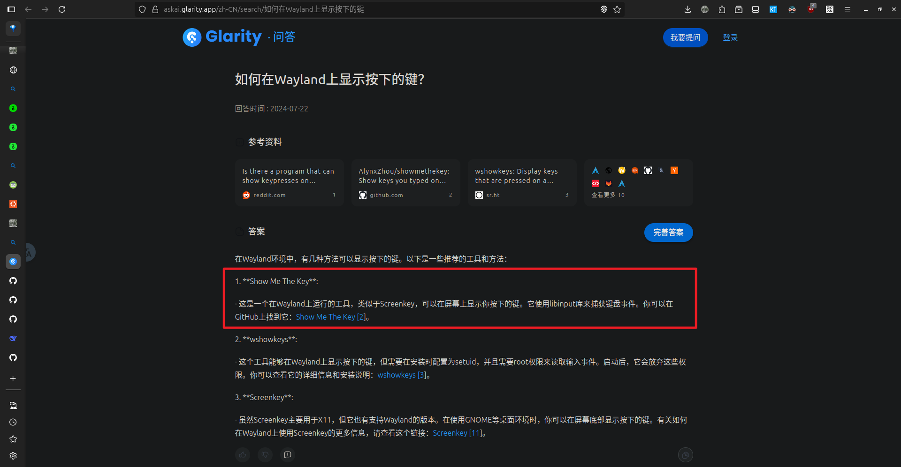
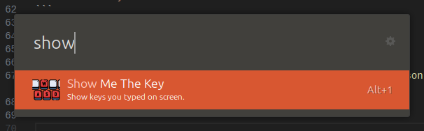
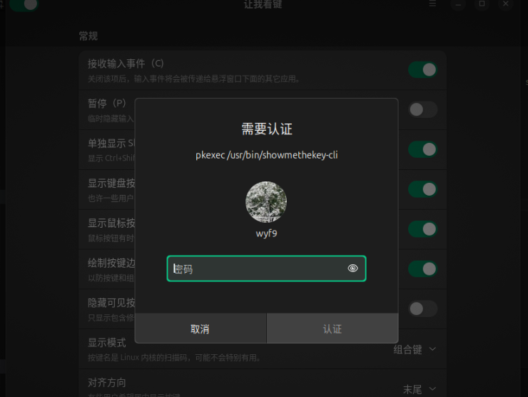
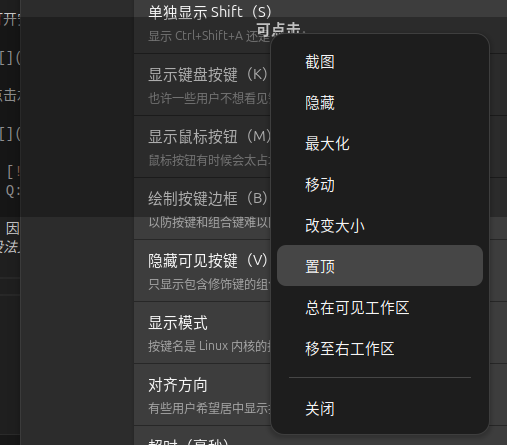
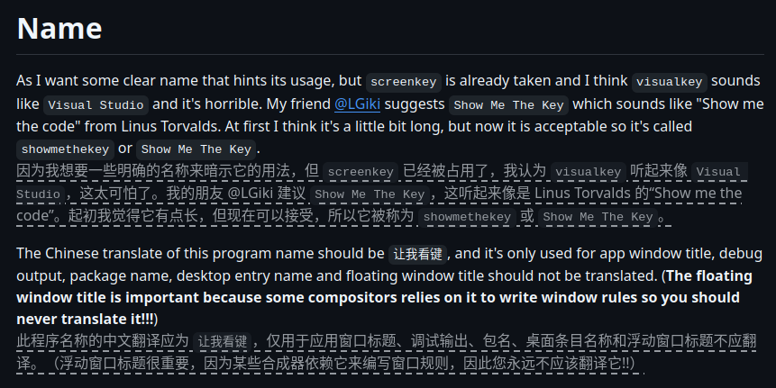

# 发现

因为我有录屏向别人展示 (?) 的习惯, 但别人看不到我的操作很难受, 遂寻找有没有软件能记录我的鼠标 / 键盘操作

起初看到了 [screenkey](https://gitlab.com/wavexx/screenkey), 但这东西只支持 x11 (我是 24.04 默认的 wayland 啊啊啊啊啊啊), 根本无法使用

重新搜索 `wayland 键盘操作显示`, 在结果中找到了这个:



::github{repo="AlynxZhou/showmethekey"}

# 安装

由于作者没有给出 deb 包 / 二进制文件, 需要手动编译

首先安装需要的依赖 & 工具链:

```sh
sudo apt update
sudo apt install \
    libevdev-dev \
    libudev-dev \
    libinput-dev \
    libglib2.0-dev \
    libgtk-4-dev \
    libadwaita-1-dev \
    libjson-glib-dev \
    libcairo2-dev \
    libpango1.0-dev \
    libxkbcommon-dev \
    libpolkit-gobject-1-dev \
    meson \
    ninja-build \
    gcc \
    build-essential \
    pkg-config \
    libgtk-4-1 \
    libadwaita-1-0 \
    libxkbcommon-x11-dev \
    libxkbregistry-dev
```

然后 clone repo:

```sh
git clone git@github.com:AlynxZhou/showmethekey.git
# 什么? 没配置 ssh? 那就用 https:
# git clone https://github.com/AlynxZhou/showmethekey.git
cd showmethekey
```

最后编译并安装:

```sh
mkdir build && cd build && meson setup --prefix=/usr . .. && meson compile && sudo meson install
```

# 使用

打开安装好的 Show Me The Key



点击左上角开关, 输入密码授权 root 权限即可使用



> [!TIP]
> Q: 为什么要授权 root 权限?
>
> 因为 Show Me The Key 是直接读取 `/dev` 下输入设备数据实现捕获鼠标键盘操作的, 故需要 root 权限 *(否则也没法支持 wayland 了)*

最后, 右键窗口标题可以置顶:



# 后记

`Show Me The Key` 这个名称的由来:



> I think visualkey sounds like Visual Studio and it's horrible.

😱😱😱😱😱😱😱😱😱😱
