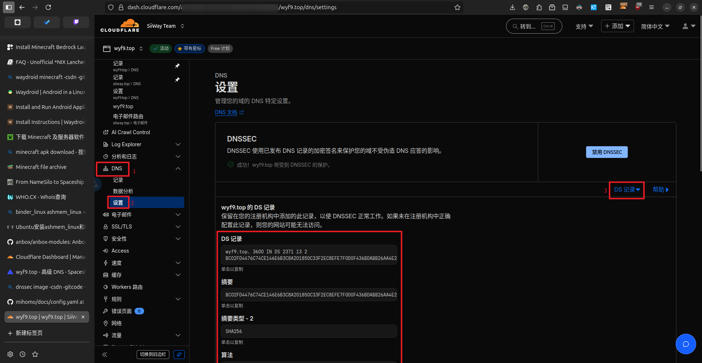
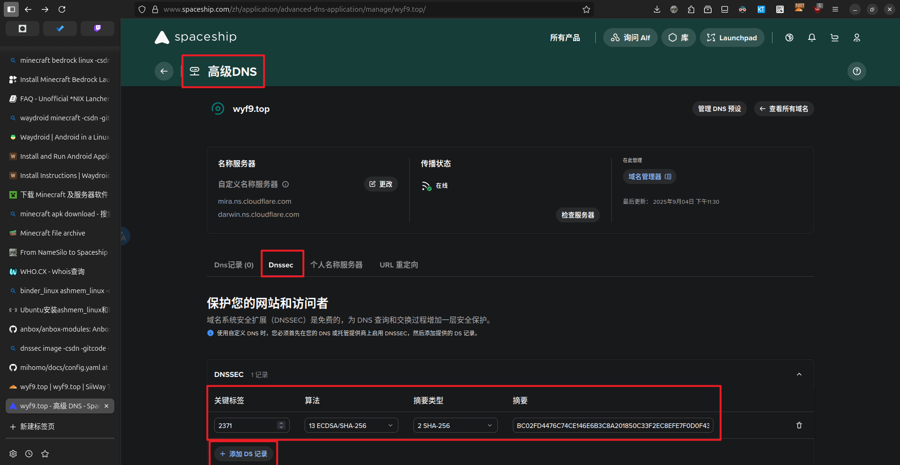
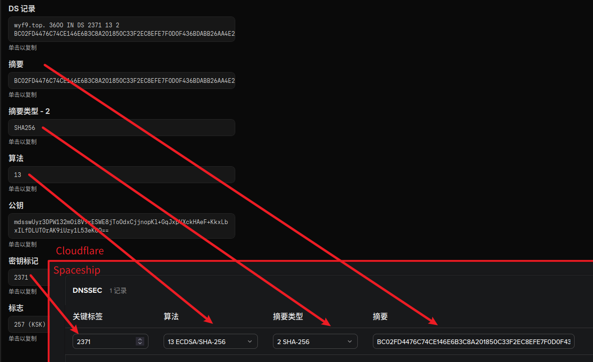

# DNSSEC 好处有哪些?

在上面了，所以让我们开始吧 (?)

>*没显示? 你没在[我的网站](https://wyf9.top/posts/spaceship-cf-dnssec)看我的 Blog!*

# Cloudflare Dashboard

首先，你需要到 Cloudflare Dashboard 获取启用 DNSSEC 所需的配置信息 (DS 记录值)

**直达链接**: https://dash.cloudflare.com/?to=/:account/:zone/dns/settings

或者手动导航到你域名的 **`DNS` -> `设置` -> `DNSSEC` -> `DS 记录`**

你需要复制下面的几个值:

- **密钥标记**
- **算法**
- **摘要类型**
- **摘要**

# Spaceship 域名设置

**直达**: `https://www.spaceship.com/zh/application/advanced-dns-application/manage/你的域名/`

或者手动导航到 **你的域名 -> `高级 DNS` -> `Dnssec`**

依次填入:

| Cloudflare 上的名称 | Spaceship 上的名称 | 示例                         |
| --------------- | -------------- | -------------------------- |
| 密钥标记            | 关键标签           | `2371`                     |
| 算法              | 算法             | `13` -> `13 ECDSA/SHA-256` |
| 摘要类型 - 2        | 摘要类型           | `SHA256` -> `2 SHA-256`    |
| 摘要              | 摘要             | `BC02FD...AA4E24`          |

保存，完事。

# Ref

封面图源: https://www.icann.org/resources/pages/dnssec-what-is-it-why-important-2019-03-20-zh
