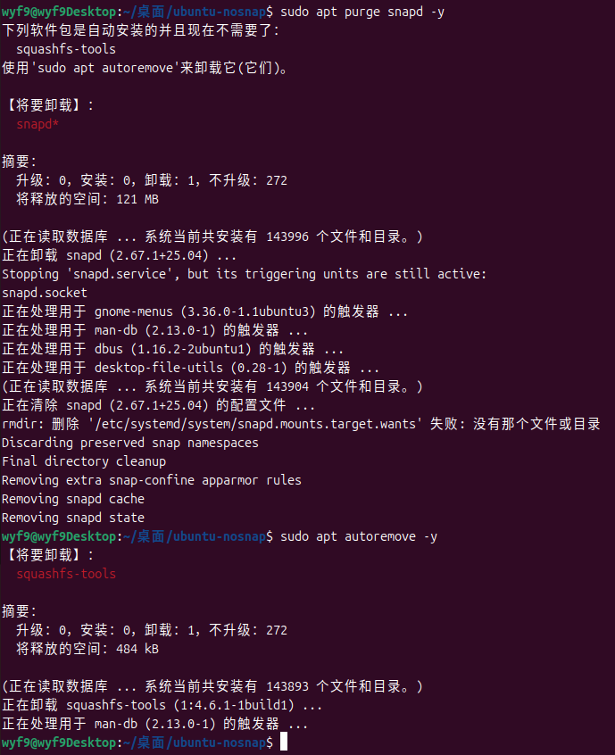
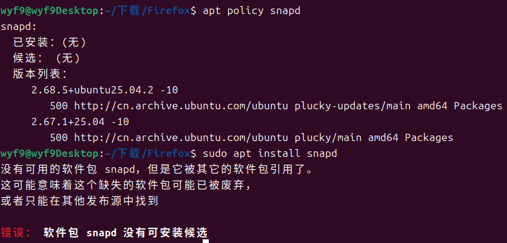
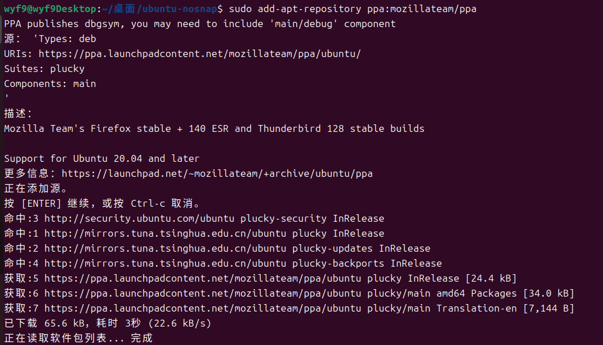
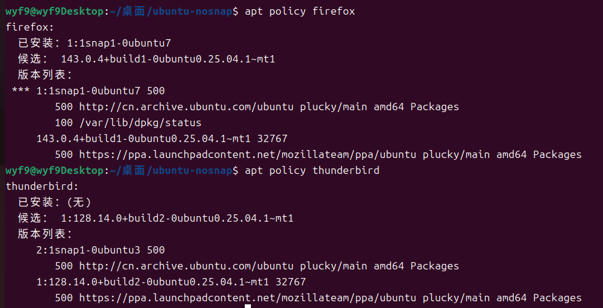

# 省流 (Ubuntu 20+)

<details>

<summary>点击展开</summary>

下面的代码将会:
1. 删除 Snapd
2. 防止 Snapd 被重新安装
3. 添加 Mozilla PPA
4. 固定 Firefox & Thunderbird 版本
5. 安装 PPA 版 Firefox & Thunderbird

> 当然，我还是建议你分步操作的 (否则出错了都不知道是哪一步)

```bash
# 1
sudo apt purge snapd -y
sudo apt autoremove -y
# 2
echo 'Package: snapd
Pin: release a=*
Pin-Priority: -10

Package: *snap*
Pin: release a=*
Pin-Priority: -10' | sudo tee /etc/apt/preferences.d/nosnap
# 3
sudo add-apt-repository ppa:mozillateam/ppa -y
# 4
echo 'Package: firefox*
Pin: release o=LP-PPA-mozillateam
Pin-Priority: 32767

Package: thunderbird*
Pin: release o=LP-PPA-mozillateam
Pin-Priority: 32767' | sudo tee /etc/apt/preferences.d/mozillateamppa
# 5
sudo apt install firefox thunderbird thunderbird-gnome-support -y
```

> 执行完建议重启

</details>

# 干掉 Snap

卸载 Snap 本体:

```
sudo apt purge snapd
sudo apt autoremove
```



执行完后 `reboot` 重启

# 阻止 Snap 死灰复燃

也很简单，编辑 `/etc/apt/preferences.d/nosnap` 写入以下内容:

```yaml
# /etc/apt/preferences.d/nosnap
Package: snapd
Pin: release a=*
Pin-Priority: -10

Package: *snap*
Pin: release a=*
Pin-Priority: -10
```

查看 `apt policy snapd`, 策略应该会阻止 snapd 和所有带 `snap` 关键词的包安装 (优先级 `-10`)

此时执行 `sudo apt install snapd` 应该会被阻止:



<!-- # Snap 软件替代

## `firmware-updater`

对应的 deb package 名: `gnome-firmware`

```bash
sudo apt install gnome-firmware -y
``` -->

# 切换到 Firefox & Thunderbird PPA

首先，添加 Firefox & Thunderbird 的 PPA 源 (两软件在同一个源):

```bash
sudo add-apt-repository ppa:mozillateam/ppa
```



接下来，编辑 `/etc/apt/preferences.d/mozillateamppa`，写入以下内容:

```yaml
# /etc/apt/preferences.d/mozillateamppa
Package: firefox*
Pin: release o=LP-PPA-mozillateam
Pin-Priority: 32767

Package: thunderbird*
Pin: release o=LP-PPA-mozillateam
Pin-Priority: 32767
```

保存退出，执行 `apt policy`, 应该看到我们新添加的 PPA 源优先级高于 Snap 版:



安装 firefox:

```bash
sudo apt install firefox
```

安装 thunderbird (邮件客户端):

```bash
sudo apt install thunderbird thunderbird-gnome-support
# thunderbird-gnome-support 是我 apt install 时看到 "建议安装" 的，就顺手加上了
```
