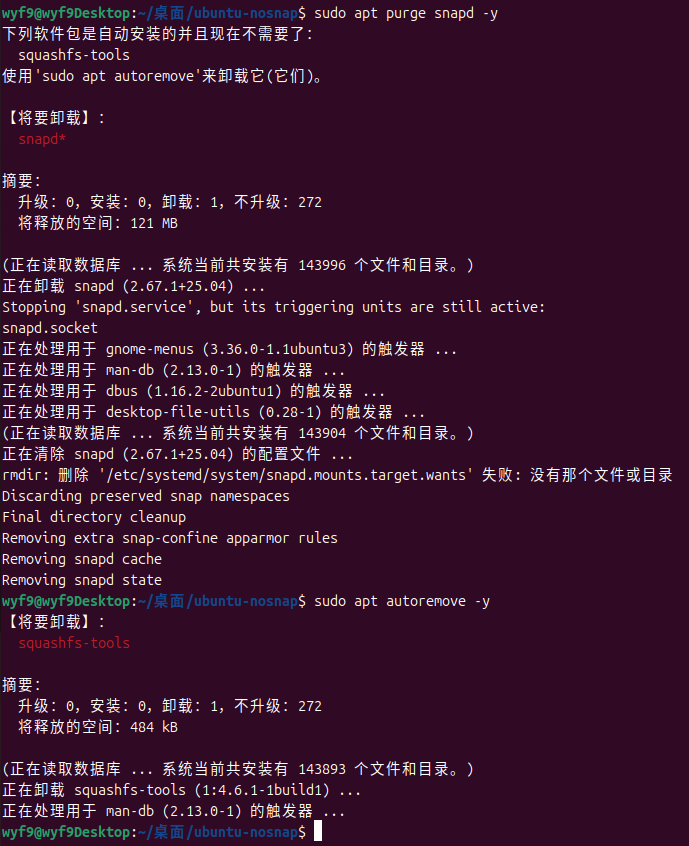

# 省流 (Ubuntu 25.04)

<details>

<summary>点击展开</summary>

下面的代码将会:
1. 删除 Snap 版 Firefox
2. 添加 Mozilla PPA
3. 固定 Firefox & Thunderbird 版本
4. 安装 PPA 版 Firefox & Thunderbird
5. ~~删除所有 Snap 包~~ *不需要，删除 snapd 时会自动处理*
6. 删除 Snapd
7. 防止 Snapd 被重新安装

> 当然，我还是建议你分步操作的 (否则出错了都不知道是哪一步)

```bash
# 1
sudo snap remove firefox --purge
# 2
sudo add-apt-repository ppa:mozillateam/ppa -y
# 3
echo 'Package: firefox*
Pin: release o=LP-PPA-mozillateam
Pin-Priority: 32767

Package: thunderbird*
Pin: release o=LP-PPA-mozillateam
Pin-Priority: 32767' | sudo tee /etc/apt/preferences.d/mozillateamppa
# 4
sudo apt install firefox thunderbird thunderbird-gnome-support -y --allow-downgrades
# 6
sudo apt purge snapd -y
sudo apt autoremove -y
# 7
echo 'Package: snapd
Pin: release a=*
Pin-Priority: -10

Package: *snap*
Pin: release a=*
Pin-Priority: -10' | sudo tee /etc/apt/preferences.d/nosnap
```

> 执行完记得重启

</details>

# 切换到 Firefox & Thunderbird PPA

首先卸载预装的 Firefox Snap 版:

```
sudo snap remove firefox --purge
```

首先，添加 Firefox & Thunderbird 的 PPA 源 (两软件在同一个源):

```bash
sudo add-apt-repository ppa:mozillateam/ppa
```


接下来，编辑 `/etc/apt/preferences.d/mozillateamppa`，写入以下内容:

```yaml
# /etc/apt/preferences.d/mozillateamppa
Package: firefox*
Pin: release o=LP-PPA-mozillateam
Pin-Priority: 32767

Package: thunderbird*
Pin: release o=LP-PPA-mozillateam
Pin-Priority: 32767
```

保存退出，执行 `apt policy`, 应该看到我们新添加的 PPA 源优先级高于 Snap 版:


安装 firefox:

```bash
sudo apt install firefox
```

安装 thunderbird (邮件客户端):

```bash
sudo apt install thunderbird thunderbird-gnome-support --allow-downgrades
# thunderbird-gnome-support 是我 apt install 时看到 "建议安装" 的，就顺手加上了
# --allow-downgrades - 允许降级 (Snap 包的版本设置得比 deb 版高)
```

# 干掉 Snap

<details>

<summary>此中内容不需要执行，仅留档</summary>

在卸载 Snap 之前，我们需要先卸载所有基于 Snap 的包

执行 `snap list`，显示 Snap 包列表:

```bash
wyf9@wyf9Desktop:~/桌面/ubuntu-nosnap$ snap list
名称                         版本               修订版本   追踪               发布者         注记
bare                       1.0              5      latest/stable    canonical✓  base
core22                     20250315         1908   latest/stable    canonical✓  base
desktop-security-center    0+git.f7ad73a    59     1/stable/…       canonical✓  -
firmware-updater           0+git.22198be    167    1/stable/…       canonical✓  -
gnome-42-2204              0+git.38ea591    202    latest/stable/…  canonical✓  -
gtk-common-themes          0.1-81-g442e511  1535   latest/stable/…  canonical✓  -
prompting-client           0+git.d542a5d    104    1/stable/…       canonical✓  -
snap-store                 0+git.90575829   1270   2/stable/…       canonical✓  -
snapd                      2.67.1           23771  latest/stable    canonical✓  snapd
snapd-desktop-integration  0.9              253    latest/stable/…  canonical✓  -
```


你可能注意到：里面有的包注记为空，有的为 `base` (`bare`, `core22`), `snapd` 单独为一个

因此，我们需要按顺序卸载它们:

```bash
# 按自己的列表调整 (但变化应该不大)
sudo snap remove desktop-security-center firmware-updater gnome-42-2204 gtk-common-themes prompting-client snap-store snapd-desktop-integration # 优先无注解
sudo snap remove bare core22 # base
sudo snap remove snapd # snapd
```

接下来

</details>

卸载 Snap 本体:

```
sudo apt purge snapd
sudo apt autoremove
```



执行完后 `reboot` 重启

# 阻止 Snap 死灰复燃

也很简单，编辑 `/etc/apt/preferences.d/nosnap` 写入以下内容:

```yaml
# /etc/apt/preferences.d/nosnap
Package: snapd
Pin: release a=*
Pin-Priority: -10

Package: *snap*
Pin: release a=*
Pin-Priority: -10
```

查看 `apt policy snapd`, 策略应该会阻止 snapd 和所有带 `snap` 关键词的包安装 (优先级 `-10`)

此时执行 `sudo apt install snapd` 应该会被阻止:


<!-- # Snap 软件替代

## `firmware-updater`

对应的 deb package 名: `gnome-firmware`

```bash
sudo apt install gnome-firmware -y
``` -->
