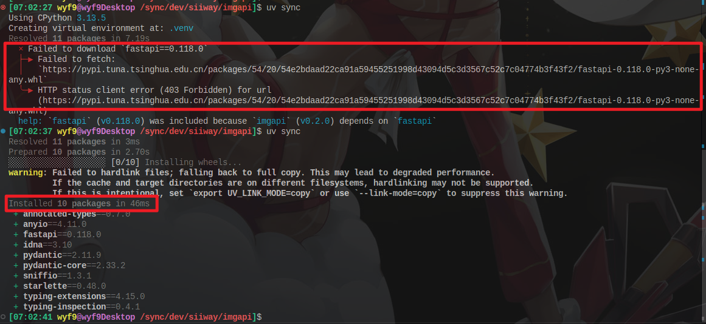

> [!TIP]
> 本文中的 Linux 路径在 Windows 上同理 (如 `/home/wyf9/.config/uv/uv.toml` -> `C:\Users\wyf9\.config\uv\uv.toml`)

# TL; DR

> Too long, didn't read

```bash
# Linux/Mac
nano /home/$USER/.config/uv/uv.toml
```

```bat
:: Windows
notepad C:\Users\%USERNAME%\.config\uv\uv.toml
```

```toml
# uv.toml
index = [
  {url = "https://pypi.tuna.tsinghua.edu.cn/simple/"},
  {url = "https://mirrors.aliyun.com/pypi/simple/"},
  {url = "https://mirror.sjtu.edu.cn/pypi/web/simple/"},
  {url = "https://mirrors.ustc.edu.cn/pypi/web/simple/"},
  {url = "https://mirrors.cernet.edu.cn/pypi/web/simple"}
]
```

# TS; JR

> Too *short*, just read

官方文档: https://docs.astral.sh/uv/concepts/configuration-files/

从以上文档中, 我们便可以知道:

- uv 的配置文件在 `(用户家目录)/.config/uv/uv.toml`
- 可以在里面配置镜像源

如果你只想设置一个镜像源:

```toml
# uv.toml
[[index]]
url = "https://pypi.tuna.tsinghua.edu.cn/simple/"
default = true
```

如果想设置多个:

```toml
# uv.toml
[[index]]
url = "https://pypi.tuna.tsinghua.edu.cn/simple/"
default = true

[[index]]
url = "https://mirrors.cernet.edu.cn/pypi/web/simple"
default = true
```

也可以用这样的格式:

```toml
# uv.toml
index = [
  {url = "https://pypi.tuna.tsinghua.edu.cn/simple/"},
  {url = "https://mirrors.aliyun.com/pypi/simple/"},
  {url = "https://mirror.sjtu.edu.cn/pypi/web/simple/"},
  {url = "https://mirrors.ustc.edu.cn/pypi/web/simple/"},
  {url = "https://mirrors.cernet.edu.cn/pypi/web/simple"}
]
```

如果你配置了多个镜像源, 可以自动负载均衡, 以及在失败时重新执行即可切换其他源下载:



所以我还是建议配置多个镜像源的 (有问题就改成一个)

## 常用的镜像列表

> [!TIP]
> 镜像描述 -> Grok

- **清华大学 (TUNA)**: https://pypi.tuna.tsinghua.edu.cn/simple/
> 国内最稳定、更新及时的镜像之一。

- **阿里云**: https://mirrors.aliyun.com/pypi/simple/
> 下载速度快，适合大规模使用。

- **中国科学技术大学 (USTC)**: https://mirrors.ustc.edu.cn/pypi/web/simple/
> 学术镜像，包完整度高。

- **上海交通大学 (SJTU)**: https://mirrors.sjtu.edu.cn/pypi/web/simple/
> 教育机构镜像，稳定可靠。

- **豆瓣**: https://pypi.douban.com/simple/
> 轻量级镜像，速度中等。

- **网易**: https://mirrors.163.com/pypi/simple/
> 商业镜像，覆盖全面。

- **腾讯云**: https://mirrors.cloud.tencent.com/pypi/simple/
> 云服务提供商镜像，下载高效。

- **搜狐**: http://mirrors.sohu.com/pypi/simple/
> 老牌镜像，适合备用。

- **北京外国语大学 (BFSU)**: https://mirrors.bfsu.edu.cn/pypi/web/simple/
> 教育镜像，更新较快。

## pip 如何设置

> 给我用 uv!!!

临时:

```bash
pip install fastapi -i MIRROR-URL
```

永久:

```bash
pip config set global.index-url MIRROR-URL
```

> [!TIP]
> 将上面的 `MIRROR-URL` 替换为你的镜像地址