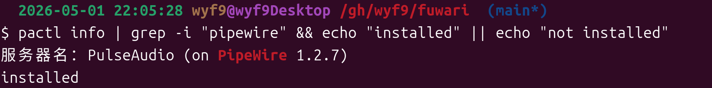

# PipeWire

> 等下，你问什么是 pipewire?

简单来说，PipeWire 是一个**低延迟的 Linux 多媒体处理引擎**，可以让你的设备处理播放音视频更快，更安全，而且对沙箱 / Wayland / 蓝牙耳机等支持友好（*better than PulseAudio*，也是 Ubuntu 22.04+ 的默认之选）

本文所述的功能需要它，因此先检测是否已经安装：

```bash
pactl info | grep -i "pipewire" && echo "installed" || echo "not installed"
```

安装了应该是这样：



如果输出 `not installed`，你需要安装并启用 PipeWire，见下面的文档 / 教程（这里不多赘述）：

- [PipeWire](https://www.pipewire.org/) - (这是官网)
- [Ubuntu 20.04 切换 pipewire 作为音频连接 - 知乎](https://zhuanlan.zhihu.com/p/679142993)
- [PipeWire - Arch Linux 中文维基](https://wiki.archlinuxcn.org/wiki/PipeWire)
- [zh\_CN/PipeWire - Debian Wiki](https://wiki.debian.org/zh_CN/PipeWire)

# 原理

通过 `pactl` 加载 `module-null-sink` 模块，来创建一个新的虚拟 Sink

然后通过 `media.class` 指定类型 (`Audio/Sink` -> 扬声器，`Audio/Source/Virtual` -> 麦克风)

再通过 `sink_name` 和 `sink_properties` 中的 `device.description` 指定不带前缀的自定义名称

完事.

## 因此你可以：

```bash
# Sink (即扬声器 / 输出)
pactl load-module module-null-sink \
  media.class=Audio/Sink \
  sink_name="SinkName" \
  sink_properties=device.description="SinkName"
```

```bash
# Mic (即麦克风 / 输入)
pactl load-module module-null-sink \
  media.class=Audio/Source/Virtual \
  sink_name="SinkName" \
  sink_properties=device.description="SinkName"
```


> [!TIP]
> 将 `SinkName` 替换为**你想要的设备名称**.

哦对了，这不是永久更改，重启恢复 *（但你可以写个 user scope 的 systemd 服务或者启动脚本？）*

## 那怎么删除呢？

也很简单，创建的时候不是会返回一个数字 id 吗？这就是加载模块的 id，直接用命令移除即可


比如我这里就是 `536870919`，那就执行

```bash
pactl unload-module 536870919
```

然后，你就会发现这个虚拟扬声器消失了（mic 同理）

# 主包主包，每次都敲这么一长串命令太麻烦了怎么办？

那就把它变成短的命令 🤓

**使用下面的命令一键 (全局) 安装脚本到你的系统：**

```bash
curl -sSf https://sh.wss.moe/v.sh | sudo bash
```

## Usage

~~for English users: use your translator~~ *theres no ~~english ~~user i think*

```bash
v.sh # 查看帮助
v.sh sink # 创建 Sink
v.sh sink "a-sink" # 创建名为 a-sink 的 Sink
v.sh mic Just A Mic # 创建名为 Just A Mic 的 Mic
v.sh del a-sink # 移除 a-sink (Sink / Mic)
v.sh rm "Just A Mic" # 移除 Just A Mic (Sink / Mic)
v.sh rm --all # 移除所有虚拟 Sink & Mic
v.sh rm --all --sink # 移除所有虚拟 Sink
v.sh rm --mic --all # 移除所有虚拟 Mic
```

### `sink`

创建虚拟输出设备 (`Audio/Sink`)

后接可选参数，如指定则用于 Sink 显示名称

如未指定，使用 `Virtual-Sink-#` (`#` 为从 1 开始的数字)

### `mic`

创建虚拟输入设备 (`Audio/Source/Virtual`)

后接可选参数，如指定则用于 Mic 显示名称

如未指定，使用 `Virtual-Mic-#` (`#` 为从 1 开始的数字)

### `rm`

删除指定名称的虚拟设备 (输入 / 输出)

后接必选参数，指定要删除的虚拟设备名称

也可以后接 `--all` 来删除所有*用本脚本创建的*虚拟设备

当使用 `--all` 时，可以加上 `--sink` 或 `--mic` 指定类型

### `del`

`rm` 的别名.

## Source

自取:

> [!TIP]
> 也发布到了 Gist (实际上上面的脚本就是拉取 gist 下载；推荐使用，此处不一定为最新) <br/>
> https://gist.github.com/wyf9/ff12240ae023da0a068f2466968e3681

<details>

<summary>点击展开</summary>

```bash
# /usr/local/bin/v.sh
#!/usr/bin/env bash
set -euo pipefail

LOCKDIR="/tmp/viraudio"
mkdir -p "$LOCKDIR"

command -v pactl >/dev/null || { echo "Missing pactl, please install it first." >&2; exit 1; }

usage() {
  cat <<EOF
Usage:
  $0 sink [NAME]
  $0 mic [NAME]
  $0 del <NAME>
  $0 rm <NAME>
  $0 rm --all
  $0 rm --all --sink
  $0 rm --all --mic

Source: https://gist.github.com/wyf9/ff12240ae023da0a068f2466968e3681
Help: https://wyf9.top/p/virtual-sink#usage
EOF
  exit 1
}

die() {
  echo "$*" >&2
  exit 1
}

lock_file() {
  local type="$1"
  local name="$2"
  printf '%s/viraudio-%s-%s-%s.lock' "$LOCKDIR" "$USER" "$name" "$type"
}

exists_name() {
  local name="$1"
  [[ -f "$(lock_file sink "$name")" || -f "$(lock_file mic "$name")" ]]
}

generate_name() {
  local type="$1"
  local prefix
  case "$type" in
    sink) prefix="Virtual Sink" ;;
    mic) prefix="Virtual Mic" ;;
  esac
  local i=1
  while exists_name "$prefix $i"; do
    ((i++))
  done
  echo "$prefix $i"
}

create_sink() {
  local name="${1:-}"

  if [[ -z "$name" ]]; then
    name=$(generate_name sink)
  fi

  if exists_name "$name"; then
    die "Virtual device '$name' already exists."
  fi

  local module_index
  module_index=$(
    pactl load-module module-null-sink \
      media.class=Audio/Sink \
      sink_name="$name" \
      sink_properties=device.description="$name"
  )

  printf '%s\n' "$module_index" > "$(lock_file sink "$name")"
  echo "Created virtual sink '$name' (module $module_index)."
}

create_mic() {
  local name="${1:-}"

  if [[ -z "$name" ]]; then
    name=$(generate_name mic)
  fi

  if exists_name "$name"; then
    die "Virtual device '$name' already exists."
  fi

  local module_index
  module_index=$(
    pactl load-module module-null-sink \
      media.class=Audio/Source/Virtual \
      sink_name="$name" \
      sink_properties=device.description="$name"
  )

  printf '%s\n' "$module_index" > "$(lock_file mic "$name")"
  echo "Created virtual mic '$name' (module $module_index)."
}

remove_name() {
  local name="$1"
  local removed=0

  for type in sink mic; do
    local lf
    lf="$(lock_file "$type" "$name")"

    if [[ -f "$lf" ]]; then
      local module_index
      module_index="$(<"$lf")"
      pactl unload-module "$module_index"
      rm -f "$lf"
      echo "Removed virtual $type '$name' (module $module_index)."
      removed=1
    fi
  done

  if [[ $removed -eq 0 ]]; then
    die "No virtual sink or mic named '$name' found."
  fi
}

remove_all() {
  local type_filter="${1:-}"
  local types=()
  local removed=0

  if [[ -z "$type_filter" ]]; then
    types=(sink mic)
  else
    types=("$type_filter")
  fi

  for type in "${types[@]}"; do
    for lf in "$LOCKDIR"/viraudio-*"-$type".lock; do
      if [[ -f "$lf" ]]; then
        local module_index
        module_index="$(<"$lf")"
        local name
        name=$(basename "$lf" "-$type.lock" | sed "s/^viraudio-[^-]*-//")
        pactl unload-module "$module_index"
        rm -f "$lf"
        echo "Removed virtual $type '$name' (module $module_index)."
        removed=$((removed + 1))
      fi
    done
  done

  if [[ $removed -eq 0 ]]; then
    die "No virtual devices found."
  fi
  echo "Total removed: $removed."
}

if [[ $# -lt 1 ]]; then
  usage
fi

cmd="$1"
shift
name="$*"

case "$cmd" in
  sink)
    create_sink "$name"
    ;;
  mic)
    create_mic "$name"
    ;;
  del|rm)
    if [[ "$name" == "--all" ]]; then
      remove_all
    elif [[ "$name" == "--all --sink" ]] || [[ "$name" == "--sink --all" ]]; then
      remove_all sink
    elif [[ "$name" == "--all --mic" ]] || [[ "$name" == "--mic --all" ]]; then
      remove_all mic
    elif [[ -z "$name" ]]; then
      die "NAME required for del/rm, or use --all."
    else
      remove_name "$name"
    fi
    ;;
  *)
    usage
    ;;
esac
```

btw, script powered by Copilot. Blog content powered by myself.

</details>
