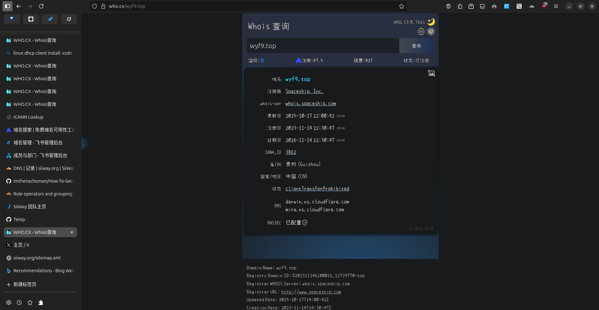
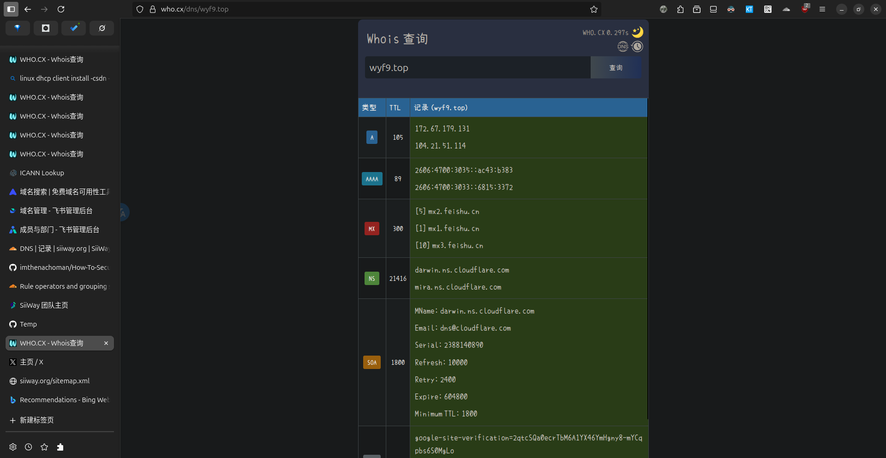
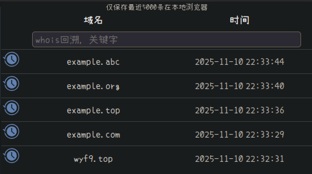

```css
/* 导入小赖字体CSS */
@import url('https://cdn.jsdmirror.com/gh/FrecklyComb1728/blog@main/public/fonts/xiaolai.css');

/* 定义小赖字体（备用） */
@font-face {
  font-family: 'xiaolai';
  src: url('https://cdn.jsdmirror.com/gh/FrecklyComb1728/blog@main/public/fonts/XiaolaiMonoSC-Regular.woff2') format('woff2'),
    url('https://cdn.jsdmirror.com/gh/FrecklyComb1728/blog@main/public/fonts/XiaolaiMonoSC-Regular.woff') format('woff');
  font-weight: normal;
  font-style: normal;
  font-display: swap;
}


/* 文字优化：使用小赖字体 */
.home_label,
#brand,
table,
#text,
#set label,
#footer a,
#search_button,
#readme_btn,
#reward_btn,
#Language,
#TimeZone,
#Currency,
#Theme,
#SuffixFilling,
#search_input,
#history-input,
#price_box,
#cost,
option,
body {
  font-family: 'xiaolai', sans-serif !important;
  font-weight: 400;
  /* 自然字重 */
  line-height: 1.6;
}
```

把上面的 CSS 粘贴到 `who.cx` 主页点击 **`自定义 CSS`** 后弹出的输入框中，点击 **✔** 保存并点 **X** 关闭输入框即可


效果:

<details>

<summary>点击展开效果图</summary>







</details>
