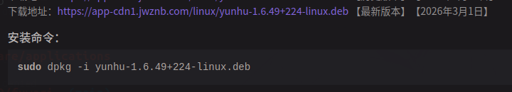
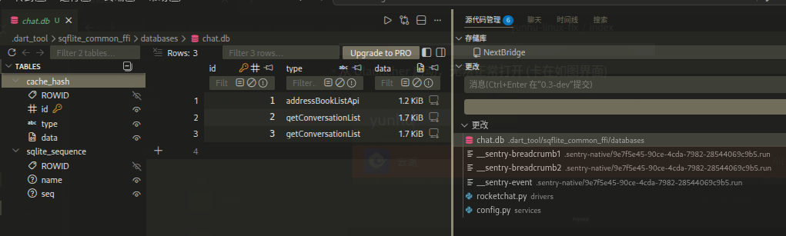

# 云湖 Linux 版启动修复

## 问题

从 https://www.yhchat.com/c/p/1087 下载了云湖的 Linux 最新版本 (1.6.49+224)



尝试启动，就发现了一个很奇怪的问题：

- 从 gnome 的应用启动器启动，可以正常打开 
- 从 Ulauncher 启动，无法正常打开 (卡在如图界面)
- 从命令行打开，正常启动，却在工作目录生成了 `.dart_tool` 和 `.sentry-native` 两个文件夹

于是，我做出大胆猜测：

*是不是因为 Ulauncher 默认在 `/usr/share/applications` 启动应用，而云湖又是相对路径存储文件，导致云湖没有权限生成本地数据库，从而启动失败?*

> *但我也不知道为什么从桌面自带启动器就可以，所以就只是猜测了*
## 实践开始

首先将上面生成的文件移动到用户目录下 `.config/yunhu` 文件夹（自己创建）

在 `/usr/bin` 下创建 `yunhu-wrapper`，写入以下内容:

```bash
# /usr/bin/yunhu-wrapper
#!/bin/bash
mkdir -p /home/$USER/.config/yunhu || true
cd /home/$USER/.config/yunhu
yunhu $*
```

然后 `sudo chmod +x /usr/bin/yunhu-wrapper` 给可执行权限

再编辑云湖的 Application 文件:

```ini
# /usr/share/applications/yunhu.desktop
[Desktop Entry]
Type=Application
Version=1.6.49+224
Name=云湖
Icon=yunhu
Exec=yunhu-wrapper %U
Categories=Social;
Keywords=云湖;聊天;社交;软件;
StartupNotify=true
```

> `Exec=yunhu %U` -> `Exec=yunhu-wrapper %U`

保存重试，即可成功用 Ulauncher 启动.
